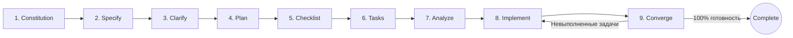

# Root — Claude Code skeleton (каркас)

This directory is a **framework / catalog**, not an app. It holds a curated library of
Claude Code tooling merged from several upstream projects, plus a `projects/` workspace.
Each project copies ONLY the tools it needs out of `library/` into its own
`projects/<name>/.claude/`. Projects are self-contained; this root is the source of truth.

This file is loaded automatically for any project nested under this folder, so the rules
below apply everywhere unless a project's own `CLAUDE.md` overrides them.

## Layout
```
start/
├── CLAUDE.md            # this file — philosophy + gate + SDD standard + lessons protocol
├── LESSONS.md           # GLOBAL lessons learned (all projects)
├── README.md            # human overview, catalog, attribution
├── .specify/            # GLOBAL Spec-Kit configuration & constitution
├── specs/               # Root specifications (if applicable)
├── library/             # the tool catalog (copy FROM here)
│   ├── spec-kit/        # github/spec-kit core: templates, schemas, scripts, workflows, extensions
│   ├── agents/          # {ecc, gsd, awesome}
│   ├── skills/          # {spec-kit, ecc, superpowers, karpathy, alireza}
│   ├── commands/        # {core, speckit, ecc, gsd}     # "core" = start-task / add-tools / lesson
│   ├── hooks/           # {ecc, gsd, superpowers}
│   ├── rules/           # {ecc, karpathy, best-practice}
│   ├── mcp/             # {starter.mcp.json, full.mcp.json, README}
│   ├── memory/          # {claude-mem}
│   ├── templates/       # {LESSONS.template.md}
│   └── CATALOG.md
├── projects/
│   ├── _templates/      # starter codebases (e.g. vibe full-stack)
│   └── <your projects>  # each has .claude/ + .specify/ + specs/ + CLAUDE.md + LESSONS.md
├── scripts/
│   ├── new-project.ps1  # scaffold a project + copy chosen tools + init spec-kit
│   ├── add-tools.ps1    # add more tools to an existing project
│   └── install-global.ps1  # install curated core (orchestrator + core cmds) into ~/.claude/
└── _sources/            # raw upstream clones (provenance; gitignored, deletable)
```

## 📐 Spec-Driven Development (github/spec-kit) — Mandatory Standard

> **Все новые и текущие проекты должны проектироваться и документироваться с использованием глобального spec-kit.**

GitHub Spec-Kit (`github/spec-kit` / `specify-cli`) является **обязательным стандартом проектирования, разработки и документирования** для всего репозитория BestStart. Код создаётся исключительно на основе формализованных спецификаций, архитектурных планов и структурированных задач под управлением проектной Конституции.

### Core SDD Workflow (Жизненный цикл фичи)



1. **📜 Constitution (`/speckit-constitution`)**:
   - Формирует и валидирует конституцию проекта (`.specify/memory/constitution.md`).
   - Содержит нерушимые правила: TDD, простота (Karpathy), Docker-изоляция, модульность. Все планы сверяются с конституцией.
2. **📝 Specify (`/speckit-specify <описание_фичи>`)**:
   - Создает спецификацию `specs/<NNN-feature-name>/spec.md`.
   - Фокусируется только на **ЧТО** и **ЗАЧЕМ** (User Stories с приоритетами P1/P2/P3, Functional Requirements `FR-XXX`, Success Criteria `SC-XXX`).
   - Каждая User Story должна быть независимо тестируемой!
3. **🔍 Clarify (`/speckit-clarify`)** *(Опционально, но рекомендуется)*:
   - Анализирует спецификацию на скрытые предположения, серые зоны и нестыковки перед началом планирования.
4. **🗺️ Plan (`/speckit-plan`)**:
   - Создает технический план `specs/<NNN-feature-name>/plan.md`, `research.md`, `data-model.md`, `contracts/`, `quickstart.md`.
   - Проверяет соответствие Конституции (Constitution Check Gate).
5. **📋 Checklist (`/speckit-checklist`)** *(Опционально)*:
   - Генерирует чеклист контроля качества для валидации требований.
6. **✅ Tasks (`/speckit-tasks`)**:
   - Декомпозирует план на атомарные задачи в `specs/<NNN-feature-name>/tasks.md`:
     - Phase 1: Setup (инфраструктура, зависимости)
     - Phase 2: Foundational (блокирующий фундамент: схемы БД, роутинг, миграции)
     - Phase 3+: Инкременты User Stories (`US1 [P1]`, `US2 [P2]`, ...)
     - Phase N: Polish & Cross-Cutting Concerns
   - Помечает параллельные задачи маркером `[P]`.
7. **🔎 Analyze (`/speckit-analyze`)** *(Опционально)*:
   - Проверяет кросс-артефактную согласованность (spec vs plan vs tasks).
8. **⚡ Implement (`/speckit-implement`)**:
   - Выполняет задачи из `tasks.md` строго в заданном порядке.
9. **🎯 Converge (`/speckit-converge`)**:
   - Сверяет текущий код с `spec.md`, `plan.md` и `tasks.md`.
   - Находит невыполненные требования и **дописывает** оставшуюся работу в конец `tasks.md` новой фазой (`## Phase N: Convergence`).
   - Никаких перезаписей — строго append-only!

### 🐛 Bug Triage & Fix Workflow (Исправление багов)
1. **/speckit-bug-assess** — Воспроизведение дефекта, изоляция первопричины (Root Cause), определение severity.
2. **/speckit-bug-fix** — Исправление по TDD: пишется падающий тест (Red) -> минимальный фикс (Green) -> рефакторинг.
3. **/speckit-bug-test** — Регрессионная верификация, проверка граничных условий, фиксация в `LESSONS.md`.

### 💡 Idea Assessment Workflow (Оценка и проработка идей)
1. **/speckit-assess-intake** — Сбор исходной идеи / запроса.
2. **/speckit-assess-shape** — Формирование контуров решения и профиля пользователя.
3. **/speckit-assess-research** — Исследование технической и продуктовой реализуемости.
4. **/speckit-assess-define** — Определение скоупа и требований.
5. **/speckit-assess-decide** — Решение Go/No-Go. При Go — передача в `/speckit-specify`.

---

## How to start a project
```powershell
./scripts/new-project.ps1 -List                          # browse the catalog
./scripts/new-project.ps1 -Name myapp -Preset lean       # minimal, add per task (spec-kit included)
./scripts/new-project.ps1 -Name shop -Template vibe -Mcp starter -Preset lean
```

## Global install (per-PC, optional)
To make the **orchestrator + the tool-selection gate** available in **any** folder on a PC
(not just under `start/`), run once per machine after cloning:
```powershell
./scripts/install-global.ps1
```
It installs a **curated core** into `~/.claude/`: the generic orchestrator
(`rules/orchestrator.md` + a managed block in `~/.claude/CLAUDE.md`) and the three core
commands (`start-task` / `add-tools` / `lesson`), plus a `skeleton-root` marker so the gate
can reach this `library/` from anywhere. The 600+ catalog is **not** copied globally — it
stays here and is pulled per-project by the gate (that's the point of `add-tools.ps1`).
`~/.claude/` is outside this repo, so `git pull` does **not** update it — re-run the script
after pulling. Project-specific orchestration (e.g. `projects/PAM/ORCHESTRATOR.md`) stays
in the project and layers on top of the generic one.

## 🤖 Autonomous workflow (the owner's standing instructions)
The owner uses this repo as a launcher: they open the root, write a prompt (or drop a `.md`),
and expect the whole task done with no manual steps. When given a task at the root:
1. Scaffold a NEW project under `projects/<name>/` via `scripts/new-project.ps1` (never build
   the app in the root itself). **Default `-Preset lean`.**
2. Run the tool-selection gate below to add ~7 task-specific tools.
3. Apply the SDD workflow (`/speckit-specify` -> `/speckit-plan` -> `/speckit-tasks` -> `/speckit-implement` -> `/speckit-converge`).
4. Build it.
5. **When done, commit and push to `origin` automatically** (this is durable authorization for
   THIS repo — don't ask each time). Always `git pull` before starting in case another machine
   pushed first.

This is the portable copy of the owner's preferences so they apply on every clone / machine.
Per-machine setup that git can't carry: GitHub auth, `.env` / MCP API keys, and `node_modules`
(reinstall). See README → "Working across machines".

## 🐳 Docker-first isolation (every project runs in its own containers)
Projects must not pollute the host or collide with each other. `new-project.ps1` (default — pass
`-NoDocker` to skip) scaffolds a per-project `docker-compose.yml` (app + its own Postgres), a
`Dockerfile`, and a `.env` with **auto-allocated free host ports** (`APP_PORT`, `DB_PORT`) so two
projects never clash. When building a project:
- Write/adjust the project's `Dockerfile` for its actual stack, then run it with
  `docker compose up --build` (the generated stub explains how). Never `npm/bun/pip install` on the
  host or bind well-known ports directly.
- Put every service the project needs (db, cache, queue) in **that project's** compose — scoped
  container names `<project>-*`, named volumes, ports taken from `.env`.
- Machine-level shared services (one n8n, a scratch Postgres) live in
  `library/docker/local-services.yml` — don't duplicate those per project.

## ⛔ Tool-selection gate (MANDATORY before building anything)
When I give you a new task or paste a prompt (mine or from another AI) inside a project,
**do not start coding immediately.** First run the gate (also available as `/start-task`):

1. Find the skeleton root (nearest ancestor with a `library/` folder) and read
   `library/CATALOG.md` + `library/mcp/README.md`.
2. Understand the task in 1–2 sentences; ask if it's truly ambiguous.
3. Propose the BEST-matching tools — a short grouped numbered list, **max ~7 total**
   (agents / skills / commands / MCP), each as `bucket/name — one-line reason`. Prefer ONE
   tool per function. Flag which are already in `.claude/`.
4. Let me pick (subset / all / none).
5. Install my picks via `scripts/add-tools.ps1` (and copy the chosen MCP entry into `.mcp.json`).
6. **Only then** start development, using the installed tools.

Skip the gate only if I explicitly say "skip tools" or the needed tools are already present.

## 📓 Learning from mistakes (LESSONS.md)
- At the start of work, read this project's `LESSONS.md` and the global `LESSONS.md` (root).
- After resolving a **non-obvious** bug or a wrong approach, append an entry with `/lesson`
  (Problem / Root cause / Fix / Rule / Scope). Put cross-project lessons in the root `LESSONS.md`.
- Don't log trivial/one-off issues. Apply existing lessons proactively.

## Conflict policy (how the merge was done)
Everything is **namespaced by source bucket**, so tools never collide. GSD is `gsd-*` prefixed.
Spec-Kit tools are `speckit-*` prefixed. True duplicates removed: agents `code-reviewer` & `seo-specialist`
(kept ECC); 5 skills from `alireza` that duplicated ECC by name. When a project enables overlapping tools,
prefer ONE per function.

## Baseline working philosophy (Karpathy guidelines — see library/rules/karpathy/)
1. **Think before coding** — surface trade-offs and ask when ambiguous.
2. **Simplicity first** — minimum code, no speculative features or abstractions.
3. **Surgical changes** — touch only what's needed; don't "improve" unrelated code.
4. **Goal-driven** — turn instructions into goals with a verification step.

A project's own `projects/<name>/CLAUDE.md` takes precedence over this file.
