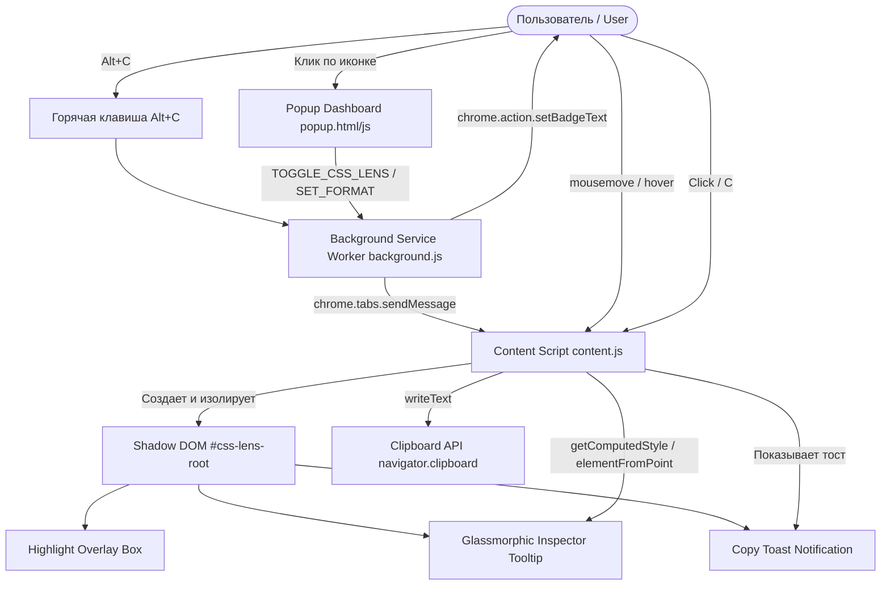

# CSS Lens - Архитектурная спецификация (Level 1 MVP) / Architectural Specification

---

## 🇷🇺 Спецификация на русском языке

### 1. Чеклист реализации (Implementation Checklist)
- [x] 1.1. Создать `manifest.json` (Manifest V3) с правами для работы со вкладками и инжекции скриптов.
- [x] 1.2. Написать `content.js` для отслеживания движения мыши (`mousemove`), точного определения элемента под курсором (`document.elementFromPoint`) и вычисления стилей через `window.getComputedStyle()`.
- [x] 1.3. Сверстать плавающую панель (инспектор-тултип) с темным полупрозрачным UI (с защитой стилей через Shadow DOM), отображающую шрифт и цвет.
- [x] 1.4. Реализовать клик по элементу для копирования свойств в буфер обмена с визуальным подтверждением.

---

### 2. Обзор проекта (Project Overview)
**CSS Lens** — это браузерное расширение (Google Chrome / Chromium) на базе Manifest V3, предназначенное для веб-дизайнеров, верстальщиков и фронтенд-разработчиков. Оно позволяет на лету инспектировать стили любого элемента веб-страницы при наведении курсора мыши и копировать форматированные стили (CSS Block, Single-Line, Tailwind CSS, JSON) в буфер обмена в один клик.

---

### 3. Архитектура и компоненты (Architecture & Components)



#### Ключевые модули:
1. **`manifest.json` (Manifest V3)**:
   - Права доступа: `activeTab`, `storage`, `clipboardWrite`, `scripting`.
   - Зарегистрированы шорткаты (`Alt+C`), фоновый Service Worker (`background.js`), Content Script (`content.js`) и Popup интерфейс.
2. **`background.js` (Service Worker)**:
   - Контролирует глобальное и per-tab состояние инспектора.
   - Обрабатывает хоткеи и сообщения от popup/content script.
   - Динамически обновляет бейдж иконки (`ON` зеленым цветом при активности).
   - Сохраняет историю недавних копирований в `chrome.storage.local`.
3. **`content.js` & Shadow DOM UI**:
   - Полная инкапсуляция через `attachShadow({ mode: 'open' })` в корневом узле `#css-lens-root`.
   - Исключает влияние стилей страницы на тултип и утечку стилей тултипа на страницу.
   - Оптимизированный трекинг мыши с помощью `requestAnimationFrame`.
   - Умное определение истинного фона (`getEffectiveBackgroundColor`) через рекурсивный обход родительских элементов при прозрачности (`transparent` / `rgba(0,0,0,0)`).
   - Интеллектуальное позиционирование тултипа с защитой от выхода за пределы экрана (`viewport boundaries collision detection`).
   - Режим фиксации (`Freeze Mode`) по нажатию `Space` или `Alt`.
   - Перехват клика (`e.preventDefault()`, `e.stopPropagation()`) и копирование стилей.
4. **`popup/` (`popup.html`, `popup.css`, `popup.js`)**:
   - Главная кнопка включения/выключения с неоновым свечением.
   - Селектор формата копирования: **CSS Block**, **Single-Line**, **Tailwind CSS**, **JSON**.
   - Таблица горячих клавиш и список недавних скопированных сниппетов.
5. **`generate-icons.js`**:
   - Автономный генератор PNG-иконок на чистом Node.js (zlib + fs).

---

### 4. Алгоритмы извлечения и нормализации данных

#### 4.1. Рекурсивное определение цвета фона (Background Color Resolution)
```javascript
function getEffectiveBackgroundColor(el) {
  let current = el;
  while (current && current !== document) {
    const style = window.getComputedStyle(current);
    const bg = style.backgroundColor;
    if (bg && bg !== 'transparent' && bg !== 'rgba(0, 0, 0, 0)') {
      return bg;
    }
    current = current.parentElement;
  }
  return 'rgb(255, 255, 255)'; // Fallback по умолчанию
}
```

#### 4.2. Конвертация RGB/RGBA в HEX
- Преобразует `rgb(r, g, b)` в `#RRGGBB`.
- Преобразует `rgba(r, g, b, a)` в `#RRGGBBAA` (с сохранением альфа-канала в HEX).
- Обрабатывает `transparent`.

#### 4.3. Очистка и группировка шрифтов (Font Family Sanitization)
- Извлекает основной стек шрифтов, удаляя лишние кавычки, и оставляет первичный шрифт и семейство-фоллбэк (например, `Inter, sans-serif`).
- Рассчитывает относительный `line-height` относительно размера `font-size` (например, `24px (1.5)`).

---

### 5. Горячие клавиши (Keyboard Shortcuts)
| Клавиша / Сочетание | Назначение |
|---|---|
| <kbd>Alt + C</kbd> | Глобальное включение/выключение CSS Lens |
| <kbd>Click</kbd> | Скопировать стили наведенного элемента в выбранном формате |
| <kbd>Space</kbd> / <kbd>Alt</kbd> | Заморозить/разморозить инспекцию элемента (Freeze Mode) |
| <kbd>C</kbd> | Быстрое копирование стилей активного элемента |
| <kbd>Esc</kbd> | Выключить режим инспекции |

---

### 6. Руководство по тестированию (Testing & Verification Guide)
1. **Установка в Chrome**:
   - Откройте браузер Chrome и перейдите на страницу `chrome://extensions/`.
   - Включите **«Режим разработчика»** (Developer mode) в правом верхнем углу.
   - Нажмите **«Загрузить распакованное расширение»** (Load unpacked) и выберите папку `projects/CSSLens`.
2. **Проверка работы на демо-странице**:
   - Откройте файл `projects/CSSLens/demo/demo.html` в браузере.
   - Нажмите <kbd>Alt + C</kbd> или активируйте тумблер в Popup.
   - Наведите курсор на кнопки, карточки, текст.
   - Убедитесь, что отображается неоновая рамка с размерами и темная карточка-инспектор со стилями.
   - Нажмите <kbd>Space</kbd> для проверки Freeze-режима.
   - Кликните по элементу для копирования стилей и убедитесь в появлении тоста «Copied to Clipboard!».
   - Вставьте скопированный текст в текстовый редактор и проверьте формат.

---

## 🇬🇧 English Architectural Specification

### 1. Overview
**CSS Lens** is a Manifest V3 Google Chrome extension designed for UI/UX designers and frontend developers. It allows instant real-time inspection of computed CSS styles (typography, dimensions, color palettes, box models) on any webpage upon hover and 1-click clipboard copying.

### 2. Isolation & Shadow DOM
To ensure 100% style isolation and guarantee that:
1. Host webpage styles do not distort the CSS Lens inspector tooltip and highlight overlay,
2. CSS Lens styles never bleed into the host webpage layout,

all UI components are mounted into `#css-lens-root` with an attached Shadow DOM (`mode: 'open'`).

### 3. Features & Capabilities
- **Real-Time Mouse Tracking**: Optimized at 60fps using `requestAnimationFrame` and `document.elementFromPoint`.
- **Deep Background Resolution**: Intelligently traverses the DOM tree to find the non-transparent ancestor background color.
- **Freeze Mode**: Lock current element in place with <kbd>Space</kbd> or <kbd>Alt</kbd> to inspect deeply without losing focus.
- **Multiple Export Formats**:
  - **CSS Block**: Full multiline CSS declaration block.
  - **Single Line**: Compact CSS properties inline.
  - **Tailwind CSS**: Approximate utility classes (`text-[16px] font-bold bg-[#...]`).
  - **JSON**: Structured style dictionary for programmatic usage.
- **Modern Dark Glassmorphism UI**: High-contrast, dark translucent panel with blur effects, color swatches, and animated notifications.

---
*Created by Core Extension Engineer for BestStart Catalog.*
