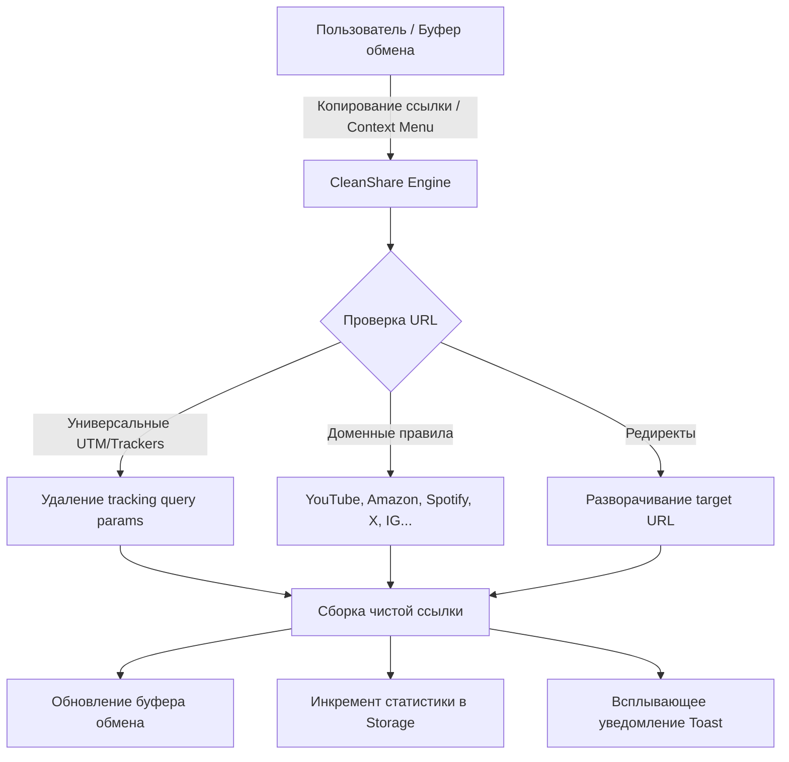

# CleanShare URL — Спецификация и Трекер задач

**CleanShare URL** — фоновое расширение для браузера Chrome (Manifest V3), предназначенное для автоматической и ручной очистки веб-ссылок от маркетинговых трекеров, параметров слежки (UTM-метки, `fbclid`, `gclid`, `yclid`, `igsh`, `si` и др.) перед копированием и распространением.

---

## 📋 Список задач

- [x] **1.1. Создать `manifest.json` (Manifest V3)**
  - Спецификация Manifest V3.
  - Права: `clipboardRead`, `clipboardWrite`, `contextMenus`, `storage`, `activeTab`, `scripting`, `notifications`.
  - Регистрация Service Worker (`background.js`).
  - Настройка иконок и контекстных действий.

- [x] **1.2. Написать регулярные выражения (Regex) и логику очистки URL в `background.js`**
  - Универсальный фильтр UTM и общих трекеров (`utm_*`, `ref`, `source`, `share`, `fbclid`, `gclid`, `yclid`, `_ga`, `_gl`, `mc_cid` и др.).
  - Доменные очистители:
    - **YouTube / YouTube Music / Shorts** (удаление `list`, `index`, `ab_channel`, `si`, `feature`, `app`, `pp` с сохранением чистого ID видео `v` и таймкода `t`).
    - **Spotify** (удаление `si`, `context` с сохранением ID треков/альбомов).
    - **Twitter / X** (удаление `s`, `t`, `ref_src`).
    - **Instagram** (удаление `igsh`, `igshid`).
    - **Reddit** (удаление `rdt_cid`, `share_id`).
    - **TikTok** (удаление `_r`, `_t`, `is_from_webapp`).
    - **Amazon** (очистка `/ref=...` в путях и query `tag`, `ref_`, `linkCode` с сохранением ASIN).
    - **AliExpress / Taobao** (очистка `spm`, `scm`, `algo_pvid`, `ws_ab_test`).
    - **Google Redirects** (разворачивание `google.com/url?q=...` в чистый целевой адрес).
  - Сохранение полезных query-параметров поиска, пагинации, фильтрации, временных меток и идентификаторов.
  - Поиск и замена нескольких URL внутри произвольного текста.
  - Подсчет статистики удаленных параметров и сохранение в `chrome.storage.local`.
  - Интеграция с Context Menus (пункты «Копировать очищенную ссылку», «Очистить URL страницы»).
  - Обработка сообщений через `chrome.runtime.onMessage`.

- [x] **1.3. Реализовать механизм уведомлений (Toasts-тост в правом нижнем углу страницы)**
  - Создан `content.css` с темной полупрозрачной темой в стиле Windows/macOS (frosted glass, backdrop blur, анимации SlideIn/SlideOut, прогресс-бар автозакрытия).
  - Создан `content.js`:
    - Мгновенный синхронный перехват `copy` (`event.clipboardData.setData`) с предотвращением записи нечищенных ссылок в буфер обмена.
    - Отображение всплывающего тоста: *"Ссылка очищена при копировании! (✨ Удалено меток: X)"* с предпросмотром ссылки и бейджем. Тост показывается только при реальной очистке.
    - Прием сообщений `SHOW_TOAST` от фонового скрипта.

- [x] **1.4. Протестировать и задокументировать сборку**
  - Разработан и пройден набор модульных тестов `test-cleaner.js` (10 сценариев очистки для YouTube плейлистов `list=WL&index=12`, YouTube таймкодов, Spotify, Amazon, X, Google Redirects, сложных UTM-параметров).
  - Сгенерирован полный комплект иконок (`icon16.png`, `icon48.png`, `icon128.png`).
  - Составлена исчерпывающая инструкция по установке, обновлению и тестированию.

---

## 🛠 Архитектура решения

## 📊 Каталог удаляемых трекеров (Базовый набор)
- **Универсальные маркетинг-трекеры:** `utm_source`, `utm_medium`, `utm_campaign`, `utm_term`, `utm_content`, `utm_id`, `utm_name`, `utm_reader`, `utm_referrer`, `utm_pubreferrer`, `utm_viz_id`, `utm_source_platform`, `utm_creative_format`, `utm_marketing_tactic`.
- **Рекламные платформы:** `fbclid`, `gclid`, `gclsrc`, `dclid`, `gbraid`, `wbraid`, `gad_source`, `msclkid`, `twclid`, `ttclid`, `yclid`, `ym_debug`, `_openstat`.
- **Аналитика:** `_ga`, `_gl`, `_hsenc`, `_hsmi`, `hsCtaTracking`, `mkt_tok`, `mc_cid`, `mc_eid`, `spm`, `scm`.
- **Социальные сети и медиа:** `igsh`, `igshid`, `si` (YouTube/Spotify), `share_id`, `rdt_cid`, `ref_src`, `ref_url`, `is_from_webapp`.
- **E-commerce рефералы:** `/ref=...` в path, `tag`, `linkCode`, `algo_pvid`, `algo_expid`, `btsid`, `ws_ab_test`.
