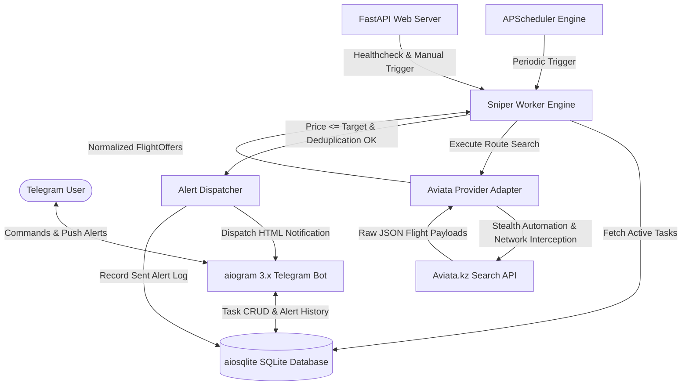

# 🦅 KzFlightSniper

[](https://www.python.org/)
[](https://fastapi.tiangolo.com/)
[](https://docs.aiogram.dev/)
[](https://playwright.dev/python/)
[](https://aiosqlite.omnilib.dev/)
[](https://www.docker.com/)
[](file:///C:/Users/Mila/Desktop/BestStart/projects/KzFlightSniper/backend/tests/)

**KzFlightSniper** is an asynchronous flight price tracking and automated alerting engine built specifically for the **Kazakhstan aviation market** (covering Air Astana, FlyArystan, SCAT Airlines, and Qazaq Air across domestic routes like `ALA` ⇄ `NQZ`, `CIT`, `SCO`, `GUW`, `UKK`, and international connections).

It runs continuous background checks using headless browser automation and stealth network interception, immediately dispatching rich Telegram notifications with direct booking links when flight prices drop below user-configured target thresholds.

---

## 📑 Table of Contents

- [Key Features](#-key-features)
- [System Architecture](#-system-architecture)
- [Quickstart Guide (Docker Compose)](#-quickstart-guide-docker-compose)
- [Local Development Setup](#-local-development-setup-without-docker)
- [Telegram Bot Command Guide](#-telegram-bot-command-guide)
- [Kazakhstan Airport Codes Reference](#-kazakhstan-airport-codes-reference)
- [REST API Endpoints](#-rest-api-endpoints)
- [Configuration Reference](#-configuration-reference-env)
- [Project Directory Structure](#-project-directory-structure)
- [Testing](#-testing)
- [License & Contributing](#-license--contributing)

---

## ⚡ Key Features

- 🎯 **Target-Based Price Sniping**: Set maximum budget thresholds in Kazakhstani Tenge (₸) for any domestic or international route.
- ✈️ **Flight-Specific Filtering**: Monitor either the cheapest available flight on a date or track a specific flight number (e.g. `KC-853`, `IQ-401`, `DV-713`).
- 🥷 **Stealth Network Interception**: Employs Playwright with `playwright-stealth` and JSON response interception (`page.on("response", ...)`) to reliably extract live ticket data without fragile DOM scraping.
- 📬 **Instant Telegram Push Alerts**: Receive immediate HTML alerts with route details, savings calculations, and direct Aviata booking deep links.
- 🛡️ **Intelligent Deduplication**: Suppresses repetitive alert spam for unchanged prices within a configurable time window (default: 60 minutes), while instantly alerting on further price drops.
- ⏱️ **Asynchronous Scheduling**: Powered by `APScheduler` for concurrent periodic route inspections with randomized jitter to prevent rate-limiting.
- 📊 **REST & Health API**: Integrated FastAPI server with `/health`, `/api/tasks`, and `/api/check-now` endpoints for manual inspections and container health checks.

---

## 🏛 System Architecture



---

## 🚀 Quickstart Guide (Docker Compose)

The easiest way to run KzFlightSniper in production or staging is using Docker and Docker Compose.

### 1. Clone & Navigate
```bash
cd projects/KzFlightSniper
```

### 2. Configure Environment Variables
Create `./backend/.env` from the example template:
```bash
cp backend/.env.example backend/.env
```
Edit `backend/.env` and insert your Telegram Bot token:
```env
BOT_TOKEN=123456789:ABCdefGhIJKlmNoPQRsTUVwxyZ
APP_PORT=8000
CHECK_INTERVAL_SECONDS=300
DATABASE_PATH=/app/data/sniper.db
LOG_LEVEL=INFO
```

### 3. Launch with Docker Compose
```bash
docker compose up -d --build
```

### 4. Verify Service Health
Check the container status and health endpoint:
```bash
curl http://localhost:8000/health
```
Expected response:
```json
{
  "status": "ok",
  "database": "connected",
  "active_tasks": 0,
  "version": "1.0.0"
}
```

---

## 💻 Local Development Setup (Without Docker)

### Prerequisites
- Python 3.10 or higher
- Chromium browser dependencies (via Playwright)

### Step 1: Create Virtual Environment
```bash
python -m venv .venv
# On Linux/macOS:
source .venv/bin/activate
# On Windows (PowerShell):
.venv\Scripts\Activate.ps1
```

### Step 2: Install Dependencies & Playwright Browsers
```bash
pip install -r backend/requirements.txt
playwright install chromium
```

### Step 3: Configure `.env`
```bash
cp backend/.env.example backend/.env
```

### Step 4: Run the Application Server
```bash
python -m uvicorn backend.main:app --host 0.0.0.0 --port 8000 --reload
```

---

## 🤖 Telegram Bot Command Guide

| Command | Syntax | Description | Example |
| :--- | :--- | :--- | :--- |
| `/start` | `/start` | Welcome message and quick start guide | `/start` |
| `/help` | `/help` | Full command reference & airport codes | `/help` |
| `/snipe` | `/snipe <ORIGIN> <DEST> <YYYY-MM-DD> <TARGET_PRICE>` | Track route under target price | `/snipe ALA NQZ 2026-10-15 25000` |
| `/snipe` | `/snipe <ORIGIN> <DEST> <YYYY-MM-DD> <FLIGHT_NO> <TARGET_PRICE>` | Track specific flight number | `/snipe ALA CIT 2026-10-20 KC-871 18000` |
| `/list` | `/list` | View your active flight tracking tasks | `/list` |
| `/delete` | `/delete <TASK_ID>` | Cancel and remove a monitoring task | `/delete 1` |
| `/cancel` | `/cancel <TASK_ID>` | Alias for `/delete` | `/cancel 1` |

### Sample Alert Notification

```text
🎯 KZ FLIGHT SNIPER — ЦЕЛЬ ОБНАРУЖЕНА!

✈️ Маршрут: ALA ➡️ NQZ
📅 Дата: 2026-10-15
🏢 Авиакомпания: Air Astana
🔢 Рейс: KC-853 (Прямой рейс ⚡)
⏰ Время: 08:00 ➡️ 09:40

💰 Найдена цена: 21 500 ₸
🎯 Ваша цель: 25 000 ₸
💸 Экономия: 3 500 ₸

🔗 Купить билет на Aviata
```

---

## 🇰🇿 Kazakhstan Airport Codes Reference

| IATA Code | City | Airport Name |
| :--- | :--- | :--- |
| `ALA` | **Almaty** | Almaty International Airport |
| `NQZ` | **Astana** | Nursultan Nazarbayev International Airport |
| `CIT` | **Shymkent** | Shymkent International Airport |
| `SCO` | **Aktau** | Aktau International Airport |
| `GUW` | **Atyrau** | Atyrau International Airport |
| `UKK` | **Oskemen** | Oskemen (Ust-Kamenogorsk) Airport |
| `AKX` | **Aktobe** | Aktobe International Airport |
| `KSG` | **Kostanay** | Kostanay International Airport |
| `PWQ` | **Pavlodar** | Pavlodar Airport |
| `PLX` | **Semey** | Semey Airport |
| `URA` | **Uralsk** | Oral Ak Zhol Airport |
| `KGF` | **Karaganda** | Sary-Arka Airport |
| `KZO` | **Kyzylorda** | Korkyt Ata Airport |
| `DMB` | **Taraz** | Taraz Airport |
| `KOV` | **Kokshetau** | Kokshetau Airport |
| `PPK` | **Petropavlovsk** | Petropavlovsk Airport |

---

## 🌐 REST API Endpoints

FastAPI provides an integrated REST interface alongside OpenAPI documentation at `http://localhost:8000/docs`.

| Method | Endpoint | Description | Response Example |
| :--- | :--- | :--- | :--- |
| `GET` | `/` | Service info and operational status | `{"app": "KzFlightSniper", "status": "running"}` |
| `GET` | `/health` | Healthcheck and active task counting | `{"status": "ok", "database": "connected", "active_tasks": 4}` |
| `GET` | `/api/tasks` | List all currently active monitoring tasks | `[{"id": 1, "origin": "ALA", "destination": "NQZ", ...}]` |
| `POST` | `/api/check-now` | Manually trigger a sniper check cycle | `{"status": "success", "stats": {"tasks_checked": 4, ...}}` |

---

## ⚙️ Configuration Reference (`.env`)

| Variable | Type | Default | Description |
| :--- | :--- | :--- | :--- |
| `BOT_TOKEN` | `str` | `placeholder_token` | Telegram Bot API token from [@BotFather](https://t.me/BotFather) |
| `APP_PORT` | `int` | `8000` | HTTP port for FastAPI REST API |
| `DATABASE_PATH` | `str` | `data/sniper.db` | Path to SQLite database file |
| `CHECK_INTERVAL_SECONDS` | `int` | `300` | Interval between flight check cycles (in seconds) |
| `HEADLESS` | `bool` | `true` | Run Playwright Chromium in headless mode |
| `ENVIRONMENT` | `str` | `production` | Environment profile (`development`, `testing`, `production`) |
| `LOG_LEVEL` | `str` | `INFO` | Logging level (`DEBUG`, `INFO`, `WARNING`, `ERROR`) |

---

## 📁 Project Directory Structure

```text
projects/KzFlightSniper/
├── backend/
│   ├── bot/
│   │   ├── __init__.py          # Bot initialization & router exports
│   │   ├── bot.py               # aiogram Bot & Dispatcher factory
│   │   └── handlers.py          # Command handlers (/snipe, /list, /delete, /start, /help)
│   ├── core/
│   │   ├── __init__.py
│   │   ├── config.py            # Pydantic Settings configuration loader
│   │   └── models.py            # Pydantic data schemas (FlightOffer, TaskRead, HealthResponse)
│   ├── db/
│   │   ├── __init__.py
│   │   ├── dao.py               # Asynchronous Data Access Object (DAO)
│   │   └── database.py          # aiosqlite connection manager & schema init
│   ├── engine/
│   │   ├── __init__.py
│   │   ├── scheduler.py         # APScheduler periodic task manager
│   │   └── sniper_worker.py     # Price monitoring worker, deduplication & alerting engine
│   ├── providers/
│   │   ├── __init__.py
│   │   ├── base.py              # BaseFlightProvider abstract base class
│   │   └── aviata_provider.py   # Aviata.kz Playwright stealth scraper & JSON interceptor
│   ├── tests/
│   │   ├── __init__.py
│   │   ├── test_integration.py  # End-to-end integration test suite
│   │   ├── test_stage2.py       # Database, DAO, and parser tests
│   │   └── test_stage3.py       # Aviata provider, worker, scheduler tests
│   ├── .env.example             # Template for environment configuration
│   ├── Dockerfile               # Production Playwright + Python container image
│   ├── main.py                  # FastAPI server entrypoint & lifespan management
│   ├── poc_aviata.py            # Standalone Playwright interception proof-of-concept
│   └── requirements.txt         # Production Python dependencies
├── data/                        # Persistent volume mount directory for SQLite DB
├── docker-compose.yml           # Multi-container service definitions
├── kzflight_sniper_spec.md      # Detailed technical specification & roadmap
├── sync.ps1                     # Windows PowerShell Git sync automation
├── sync.sh                      # POSIX Bash Git sync automation
└── README.md                    # Project documentation
```

---

## 🧪 Testing

The test suite contains 20 comprehensive unit and end-to-end integration tests covering database transactions, argument validation, JSON payload parsing, mock provider responses, alert deduplication, bot command dispatching, and REST endpoints.

Run the test suite locally:
```bash
pytest backend/tests/ -v
```

Expected test output:
```text
============================= test session starts =============================
backend/tests/test_integration.py::TestKzFlightSniperIntegration::test_app_lifespan_lifecycle PASSED
backend/tests/test_integration.py::TestKzFlightSniperIntegration::test_bot_handlers_full_pipeline PASSED
backend/tests/test_integration.py::TestKzFlightSniperIntegration::test_e2e_sniper_check_cycle_and_alert_dispatch PASSED
backend/tests/test_integration.py::TestKzFlightSniperIntegration::test_fastapi_rest_endpoints_live_db PASSED
backend/tests/test_stage2.py::TestStage2Components::test_dao_alert_logging_and_deduplication PASSED
backend/tests/test_stage2.py::TestStage2Components::test_dao_task_crud_operations PASSED
backend/tests/test_stage2.py::TestStage2Components::test_database_init PASSED
backend/tests/test_stage2.py::TestStage2Components::test_fastapi_endpoints PASSED
backend/tests/test_stage2.py::TestStage2Components::test_pydantic_models PASSED
backend/tests/test_stage2.py::TestStage2Components::test_snipe_argument_parsing PASSED
backend/tests/test_stage3.py::TestStage3Components::test_aviata_json_parser_alternative_structures PASSED
backend/tests/test_stage3.py::TestStage3Components::test_aviata_json_parser_standard PASSED
backend/tests/test_stage3.py::TestStage3Components::test_aviata_provider_search_convenience_filter PASSED
backend/tests/test_stage3.py::TestStage3Components::test_format_alert_message PASSED
backend/tests/test_stage3.py::TestStage3Components::test_manual_check_endpoint PASSED
backend/tests/test_stage3.py::TestStage3Components::test_scheduler_lifecycle PASSED
backend/tests/test_stage3.py::TestStage3Components::test_sniper_worker_alert_trigger PASSED
backend/tests/test_stage3.py::TestStage3Components::test_sniper_worker_deduplication PASSED
backend/tests/test_stage3.py::TestStage3Components::test_sniper_worker_flight_number_filter PASSED
backend/tests/test_stage3.py::TestStage3Components::test_sniper_worker_price_above_target_no_alert PASSED

============================= 20 passed in 4.00s ==============================
```

---

## 📜 License & Contributing

Licensed under the [MIT License](../../LICENSE). Contributions, bug reports, and route provider extensions (e.g. Kaspi Travel, Chocotravel, direct airline integrations) are welcome!
