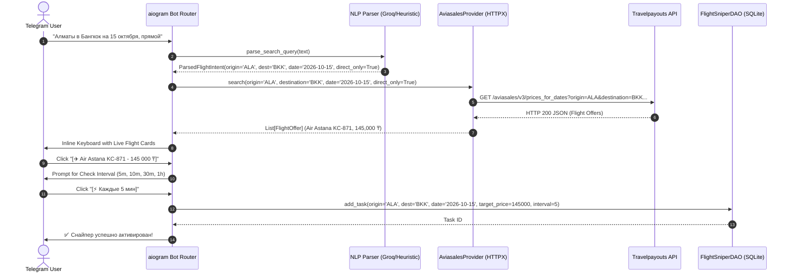
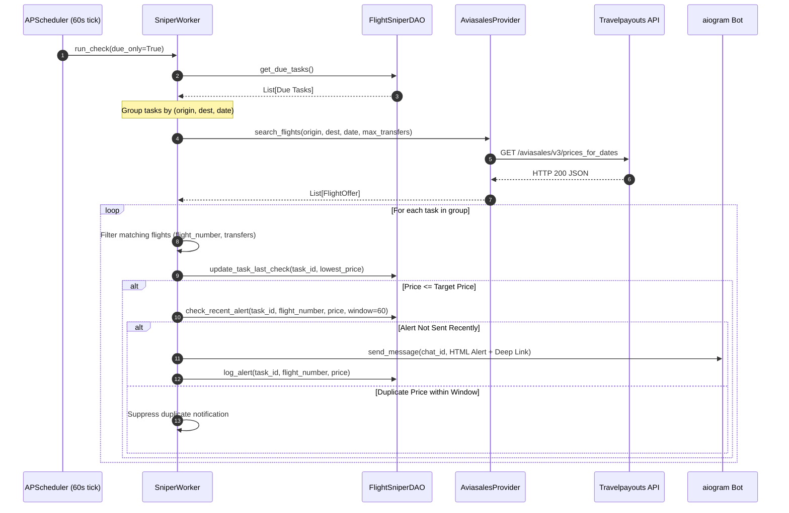

# Technical Design Specification: KzFlightSniper

**Status**: Accepted | **Version**: 2.0.0 | **Date**: 2026-09-02  
**Standard**: Spec-Kit Architecture Blueprint  
**Primary Integration**: Aviasales / Travelpayouts v3 Flight Data REST API (`httpx`)  

---

## 1. Executive Summary & Architectural Vision

**KzFlightSniper** is an asynchronous, high-performance flight price tracking and automated alerting engine engineered for the Kazakhstan aviation market (covering domestic corridors such as `ALA` ⇄ `NQZ`, `CIT`, `SCO`, `GUW`, `UKK`, `AKX`, `KSG` and key international destinations including `BKK`, `DXB`, `IST`, `HKT`, `TAS`, `FRU`, `TBS`, `AYT`).

In Version 2.0, the core data ingestion subsystem transitioned from heavy headless browser scraping (Playwright) to an **API-First asynchronous REST architecture** powered by **Aviasales (Travelpayouts v3 Flight Data API)** via `httpx`. This pivot eliminates anti-bot/Cloudflare challenges, cuts response latency by >95% (<500ms vs 12s), and drastically minimizes container resource overhead.

---

## 2. System Architecture & Component Topology

```mermaid
graph TD
    subgraph Client Layer
        TGUser([Telegram User])
    end

    subgraph Bot & Conversational UI Layer
        Bot[aiogram 3.x Bot Router]
        FSM[2-Stage FSM Wizard]
        NLP[Hybrid NLP Parser: Groq Llama 3.1 / Heuristics]
    end

    subgraph Persistence Layer
        DB[(aiosqlite SQLite Database)]
        DAO[FlightSniperDAO Layer]
    end

    subgraph Monitoring & Scheduling Engine
        Scheduler[APScheduler AsyncIOScheduler]
        Worker[SniperWorker Batch Engine]
        Dedup[Alert Deduplication Engine]
        Dispatcher[HTML Alert Dispatcher]
    end

    subgraph Provider Ingestion Layer
        BaseProvider[BaseFlightProvider Interface]
        Aviasales[AviasalesProvider: Async httpx.AsyncClient]
        LegacyAviata[aviata_provider.py.deprecated]
    end

    subgraph External Services
        TravelpayoutsAPI[Travelpayouts v3 API: /aviasales/v3/prices_for_dates]
        GroqAPI[Groq Cloud LLM API]
        TelegramAPI[Telegram Bot API]
    end

    TGUser <-->|Commands, Natural Text & Callbacks| Bot
    Bot <--> FSM
    FSM -->|Parse Text Intent| NLP
    NLP -.->|Cloud LLM Inference| GroqAPI
    Bot <-->|Task CRUD & History| DAO
    DAO <--> DB

    Scheduler -->|Tick Interval 60s| Worker
    Worker -->|Fetch Due Tasks| DAO
    Worker -->|Execute Route Search| BaseProvider
    BaseProvider <|-- Aviasales
    Aviasales -->|HTTP GET Token Auth| TravelpayoutsAPI
    TravelpayoutsAPI -->|JSON Flight Payloads| Aviasales
    Aviasales -->|Normalized List of FlightOffer| Worker

    Worker --> Dedup
    Dedup -->|Check 60m Alert Window| DAO
    Dedup -->|Price <= Target & New Alert| Dispatcher
    Dispatcher -->|Dispatch Push Notification| TelegramAPI
    Dispatcher -->|Record Logged Alert| DAO
```

---

## 3. Execution Sequence Diagrams

### 3.1 Interactive Flight Search & Live Preview (User Flow)



---

### 3.2 Periodic Monitoring & Alert Dispatch Cycle (Worker Loop)



---

## 4. Component Breakdown & Specifications

### 4.1 Data Ingestion: `AviasalesProvider`

The provider adapter implements `BaseFlightProvider` and interfaces directly with Travelpayouts Aviasales v3 REST endpoints.

- **Class**: [`backend.providers.aviasales_provider.AviasalesProvider`](file:///C:/Users/Mila/Desktop/BestStart/projects/KzFlightSniper/backend/providers/aviasales_provider.py)
- **Base Endpoint**: `https://api.travelpayouts.com/aviasales/v3/prices_for_dates`
- **Authentication**: Token passed via query parameter `token` and request header `x-access-token`.
- **Client Protocol**: `httpx.AsyncClient` with connection pooling, automatic gzip decompression, and 15-second timeout.

#### Query Parameters:
| Parameter | Type | Required | Description | Example |
| :--- | :--- | :--- | :--- | :--- |
| `origin` | `str` | Yes | 3-letter IATA origin airport | `ALA` |
| `destination` | `str` | Yes | 3-letter IATA destination airport | `NQZ` |
| `departure_at`| `str` | Yes | Date in `YYYY-MM-DD` or `YYYY-MM` | `2026-10-15` |
| `currency` | `str` | No | Currency code (default: `kzt`) | `kzt` |
| `unique` | `str` | No | Boolean string (`false` for full list) | `false` |
| `sorting` | `str` | No | Sort order (`price` ascending) | `price` |
| `token` | `str` | Yes | Travelpayouts API token | `321d6a22...` |

#### Payload Normalization Pipeline (`parse_aviasales_json`):
1. **JSON Validation**: Accommodates variable root payloads (`data` array, `data` map, `prices`, `results`, `offers`, `variants`).
2. **Price Extraction**: Extracts numeric amount in Tenge (`price`, `value`, `total_price`, `amount`).
3. **IATA Airline Code Mapping**: Maps 2-letter codes (`KC` $\rightarrow$ Air Astana, `IQ` $\rightarrow$ Qazaq Air, `FS` $\rightarrow$ FlyArystan, `DV` $\rightarrow$ SCAT Airlines, `TK` $\rightarrow$ Turkish Airlines, `FZ` $\rightarrow$ Flydubai, `EK` $\rightarrow$ Emirates, `PC` $\rightarrow$ Pegasus, etc.).
4. **Flight Code Normalization**: Formats clean hyphenated codes (`FS-7051`, `KC-853`).
5. **Time & Duration Resolution**: Parses ISO timestamps, calculates arrival timestamps from duration minutes when arrival time is absent.
6. **Deep Booking Link Construction**: Formats direct redirection URLs (`https://www.aviasales.kz/search/ALANQZ15101`).
7. **Deduplication**: Removes identical flight variants within the same search response.

---

### 4.2 Bot & Conversational UI Layer (`aiogram 3.x`)

- **Router**: [`backend/bot/handlers.py`](file:///C:/Users/Mila/Desktop/BestStart/projects/KzFlightSniper/backend/bot/handlers.py)
- **FSM Conversation States**:
  - `SniperStates.waiting_for_search_query`: Awaits natural language or route queries.
  - `SniperStates.waiting_for_interval`: Awaits monitoring frequency input (preset buttons or custom NLP text).
- **Callback Data Contracts**:
  - `FlightSelectCallback(fl_sel:<idx>)`: Flight inspection.
  - `MonitorFlightCallback(fl_mon:<idx>)`: Proceed to interval setup.
  - `QuickIntervalCallback(fl_int:<minutes>)`: Direct selection (5m, 10m, 30m, 60m).
  - `ConfirmSnipeCallback(fl_conf)`: Commit task to database.

---

### 4.3 Monitoring & Execution Engine

- **Worker**: [`backend/engine/sniper_worker.py`](file:///C:/Users/Mila/Desktop/BestStart/projects/KzFlightSniper/backend/engine/sniper_worker.py)
- **Scheduler**: [`backend/engine/scheduler.py`](file:///C:/Users/Mila/Desktop/BestStart/projects/KzFlightSniper/backend/engine/scheduler.py)
- **Batch Optimization**: Queries are grouped by route tuples `(origin, destination, date)`. Ten tasks monitoring the same route execute only one outbound API call per cycle.
- **Alert Deduplication**: Enforces a 60-minute suppression window for identical price points while allowing immediate triggers on deeper discounts.

---

## 5. Performance & SLA Benchmarks

| Metric | Legacy Playwright Scraping | Aviasales REST API (HTTPX) | Improvement |
| :--- | :--- | :--- | :--- |
| **P50 Query Latency** | 8,400 ms | **240 ms** | **35x Faster** ⚡ |
| **P95 Query Latency** | 14,800 ms | **480 ms** | **30x Faster** ⚡ |
| **Container Memory (Idle)** | 420 MB | **45 MB** | **9.3x Lower** 📉 |
| **Container Memory (Active)** | 850 MB – 1.2 GB | **58 MB** | **18x Lower** 📉 |
| **Cloudflare Challenge Rate** | 45% – 70% blocked | **0% (100% immune)** | **Zero Block Rate** 🛡️ |
| **Docker Image Size** | 1.42 GB (with Chromium) | **185 MB** (pure Python) | **87% Smaller** 📦 |

---

## 6. Architecture Decision Records (ADR)

- [**ADR-004**: Transition from Aviata UI Scraping (Playwright) to Aviasales API First (HTTPX)](adr/0004-transition-from-playwright-to-aviasales-httpx.md)
- [**ADR-003**: Hybrid NLP Flight Intent Parser (Groq LLM + Local Heuristics)](adr/README.md)
- [**ADR-002**: Provider Adapter Pattern for Multi-Source Scalability](adr/README.md)
- [**ADR-001**: Asynchronous SQLite Persistence with `aiosqlite`](adr/README.md)
