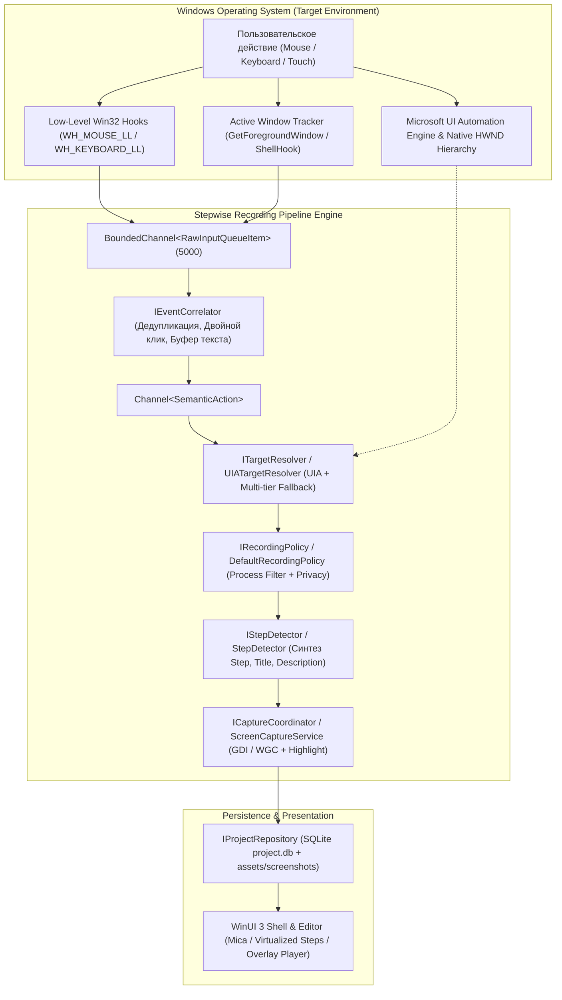
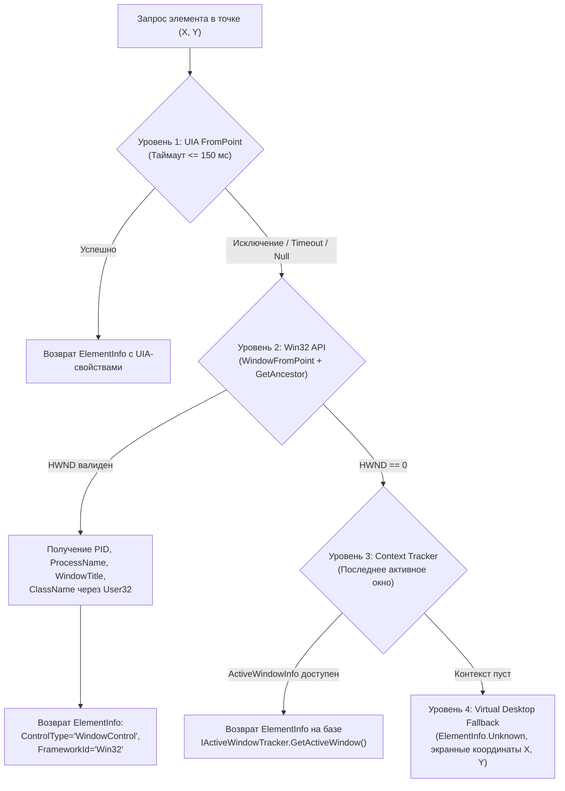
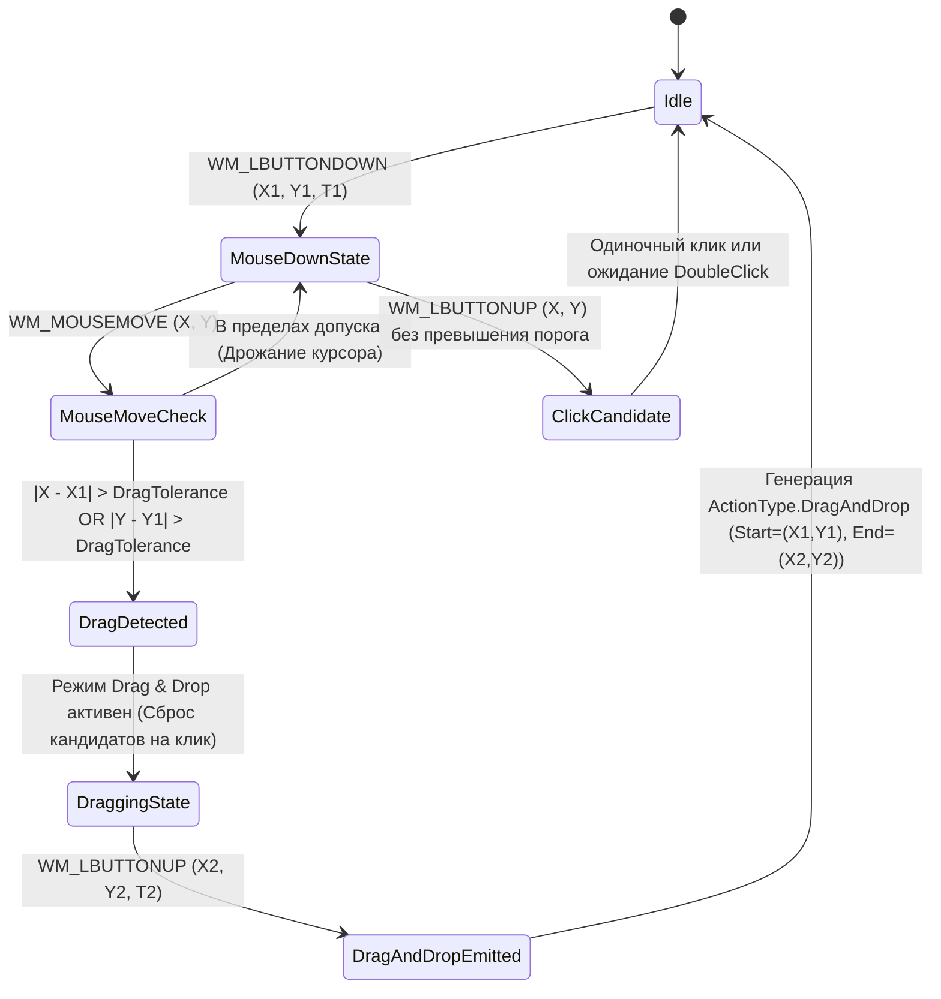
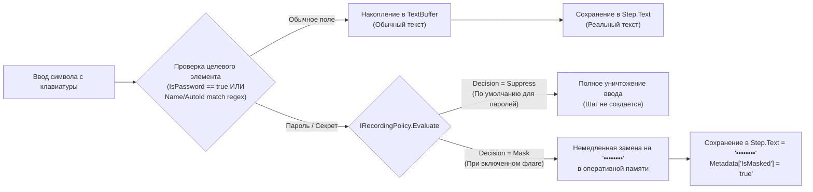

# Stepwise — Матрица реальных Windows Target Types и Сценариев Stage 4

> **Статус документа:** Официальный архитектурно-инженерный контракт (Stage 4 Specification)  
> **Область действия:** `Stepwise.Core`, `Stepwise.WindowsIntegration`, `Stepwise.TestTarget`, `Stepwise.Tests`  
> **Целевая платформа:** Windows 10/11 (x64 / ARM64), .NET 9, WinUI 3, Microsoft UI Automation (UIA3 / UIA2), Win32 API  
> **Дата фиксации:** Сентябрь 2026  

---

## 1. Введение и Архитектурный Контекст

### 1.1. Назначение документа
Настоящий документ определяет исчерпывающую матрицу поддерживаемых типов Windows-приложений (**Windows Target Types Matrix**), детальное исследование поведения **Microsoft UI Automation (UIA)** в реальной ОС Windows, спецификацию эталонных сквозных сценариев (**Real-World Golden Scenarios A–H**) и контракты семантической обработки пользовательского ввода и защиты конфиденциальных данных.

### 1.2. Место в конвейере Stepwise (Stage 4 Pipeline Context)
Stepwise следует строгому конвейеру преобразования сырых низкоуровневых системных прерываний в структурированные шаги интерактивных руководств:



### 1.3. Ключевые фундаментальные правила
1. **Offline-first и Zero-AI ядро:** Движок записи и инспекции окон опирается исключительно на факты операционной системы Windows. AI привлекается опционально и строго постфактум для рерайтинга заголовков.
2. **Никаких предположений без проверки:** Метаданные окон и элементов могут отсутствовать, запаздывать или исчезать. Каждый компонент конвейера обязан иметь детерминированный fallback-контракт.
3. **Zero Plaintext Privacy:** Ни один символ пароля или учетных данных не должен попасть в оперативную память в открытом виде, в БД SQLite, в файлы скриншотов, логи или диагностические дампы.

---

## 2. Матрица реальных Windows Target Types (Section 4)

В современной среде Windows сосуществуют различные поколения графических подсистем и UI-фреймворков. Конвейер Stepwise классифицирует и адаптирует обработку для 8 целевых категорий:

| Target Type | Ключевые примеры | UI-технология / Runtime | Базовый FrameworkId в UIA | Наличие HWND у контролов | Особенности доступности метаданных |
| :--- | :--- | :--- | :--- | :--- | :--- |
| **A. Win32 Classic** | Notepad (`notepad.exe`), Regedit, TaskMgr classic | C/C++, GDI/GDI+, Comctl32, User32 | `"Win32"` | **Да** (каждый контрол — отдельный HWND) | Отсутствует `AutomationId`. `Name` берется из `WM_GETTEXT` или прилинкованного Static-лейбла. |
| **B. WPF** | `Stepwise.TestTarget`, Visual Studio Shell, enterprise-софт | .NET, PresentationFramework, DirectX | `"WPF"` | **Нет** (единый HWND окна; контролы windowless) | Полная поддержка `AutomationProperties.AutomationId`, `Name`, `IsPassword`. Стабильное логическое дерево. |
| **C. WinUI 3** | `Stepwise.App`, Settings (Win11), Calculator (Win11) | C++ / C# .NET, Windows App SDK, DirectComposition | `"XAML"` | **Нет** (HWND острова `DesktopChildSiteBridge`) | Иерархия `FrameworkElementAutomationPeer`. Высокая точность BoundingBox при Per-Monitor DPI v2. |
| **D. Browser / Chromium** | Microsoft Edge (`msedge.exe`), Google Chrome, Electron | Blink, V8, DirectWrite, Skia | `"Chrome"` (или `"InternetExplorer"`) | **Нет** (единый контейнер `Chrome_RenderWidgetHostHWND`) | Ленивая инициализация accessibility дерева (AXTree). BoundingBox требует учета скролла web-страницы. |
| **E. Windows Explorer** | `explorer.exe` (дерево папок, список файлов, тулбар) | Shell Namespaces, DirectUI, modern XAML islands | `"DirectUI"`, `"Win32"`, `"XAML"` | **Смешанный** (`CabinetWClass` -> `SHELLDLL_DefView`) | Виртуализированный `ItemsView`. Динамические Shell-хэши в качестве ID элементов. |
| **F. Стандартные контролы** | TextBox, Button, ComboBox, ListBox | Comctl32 / Forms / WPF / WinUI | Вариативно | Вариативно | Стандартные паттерны: `IValueProvider`, `IInvokeProvider`, `IExpandCollapseProvider`, `ISelectionProvider`. |
| **G. Кастомные / Canvas** | CAD-системы, игры, Blender, Qt/Skia, WinForms GDI+ | DirectX, OpenGL, Vulkan, Skia, Custom GDI | `"Win32"`, `"Custom"`, `"Unknown"` | **Только окно-контейнер** | Полное отсутствие дочерних элементов UIA. Работа исключительно по координатному и оконному фоллбеку. |
| **H. Поля паролей** | PasswordBox, Windows Security Prompt, Web Password | Любой фреймворк с флагом `IsPassword == true` | Любой | Любой | Принудительное маскирование `••••••••`, подавление `TextInput` по умолчанию, защита от утечек в SQLite/скриншоты. |

---

### Подробная характеристика целевых типов

#### A. Win32 Classic Application
- **Архитектура:** Классическая оконная процедура `WndProc`, дерево дескрипторов `HWND`. Родительское окно (`#32770`, `Notepad` и др.) содержит дочерние HWND оконных классов `Edit`, `Button`, `ComboBox`, `ListBox`, `ToolbarWindow32`.
- **UIA Provider:** Реализуется через системный мост трансляции UIA-to-MSAA (`oleacc.dll` / `UIAutomationCore.dll`).
- **Свойства:**
  - `FrameworkId`: `"Win32"`.
  - `AutomationId`: Как правило, пустая строка `""`. В редких случаях UIA мост транслирует целочисленный Control ID (`GetDlgCtrlID`) в строковом виде.
  - `ClassName`: Истинные имена оконных классов Win32 (`"Edit"`, `"Button"`, `"RichEdit20W"`, `"SysListView32"`).
  - `Name`: Для кнопок — текст надписи; для полей `Edit` — часто пустая строка или имя ассоциированного статического текста (`Static`), расположенного слева/сверху по Z-order.
  - `WindowHandle`: Истинный дочерний `HWND` контрола (отличается от дескриптора главного окна).

#### B. WPF Application (на примере `Stepwise.TestTarget`)
- **Архитектура:** Единый контейнерный HWND (`HwndSource` / `HwndWrapper`). Внутри окна все элементы (`Button`, `TextBox`, `ListBoxItem`) являются графическими примитивами visual tree, рисуемыми через Milcore / DirectX.
- **UIA Provider:** Нативная реализация интерфейсов `IRawElementProviderSimple`, `IRawElementProviderFragment` через подсистему `UIElementAutomationPeer`.
- **Свойства:**
  - `FrameworkId`: `"WPF"`.
  - `AutomationId`: Определяется через аттрибут `AutomationProperties.AutomationId` (например, `txtStandard`, `pwdSecure`, `btnAction`). При отсутствии — совпадает с `x:Name`.
  - `Name`: `AutomationProperties.Name` или строковое значение `Content` / `Header`.
  - `IsPassword`: Для `PasswordBox` строго возвращает `true`.
  - `WindowHandle`: Все дочерние элементы возвращают `HWND` родительского окна верхнего уровня.

#### C. WinUI 3 / Windows App SDK (на примере `Stepwise.App`)
- **Архитектура:** Современная композитная модель на базе DirectComposition. Окно верхнего уровня (`WinUIDesktopWin32WindowClass`) хостит XAML Islands через остров `DesktopChildSiteBridge`.
- **UIA Provider:** Высокопроизводительный modern XAML UIA Provider.
- **Свойства:**
  - `FrameworkId`: `"XAML"`.
  - `AutomationId`: Полноценная поддержка через `AutomationProperties.AutomationId`.
  - `BoundingRectangle`: Автоматически масштабируется с учетом коэффициента Per-Monitor High-DPI (100%, 125%, 150%, 200%).
  - `ClassName`: Внутренние типы WinUI (например, `Microsoft.UI.Xaml.Controls.Button`).

#### D. Browser / Chromium-Based Application (Edge, Chrome, Electron)
- **Архитектура:** Многопроцессная архитектура: Browser Process координирует UI, Renderer Process исполняет JS и строит DOM, GPU Process выполняет растеризацию. Главный viewport отрисовывается в HWND класса `Chrome_RenderWidgetHostHWND`.
- **UIA Provider:** Движок Chromium Accessibility (Blink AXTree -> Windows UI Automation / IAccessible2).
- **Специфика Chromium (Lazy Accessibility Tree):**
  > [!IMPORTANT]
  > Chromium по умолчанию **не генерирует дерево UIA**, экономя память и CPU. Полноценное дерево строится только после первого обращения клиента UIA (получение системного сообщения `WM_GETOBJECT` с флагом `OBJID_CLIENT`).
  > Первичный вызов `InspectElementAt(x, y)` в окне браузера может занять от 50 до 200 мс. Все последующие вызовы происходят за 2–10 мс.
- **Свойства:**
  - `FrameworkId`: `"Chrome"`.
  - `ControlType`: `Document`, `Group`, `Hyperlink`, `Button`, `Edit`.
  - `AutomationId`: Транслируется из HTML-атрибута `id` или `aria-` метаданных.
  - `Name`: Текст тега, `aria-label`, атрибут `title`, `placeholder` или `alt`.
  - `IsPassword`: Для тега `<input type="password">` всегда `true`.

#### E. Windows Explorer (`explorer.exe`)
- **Архитектура:** Сложный составной шелл. Главное окно `CabinetWClass` включает навигационную панель, адресную строку `AddressBandRoot`, BreadcrumbBar, дерево каталогов `SysTreeView32` и рабочую область `SHELLDLL_DefView` с виртуализированным списком файлов `DirectUIHWND` / `UIItemsView`.
- **Свойства:**
  - `FrameworkId`: `"DirectUI"`, `"Win32"`, `"XAML"` (в Windows 11 вкладки Explorer работают на XAML).
  - `Name`: Содержит реальное имя файла/папки (например, `Stepwise.sln`, `Documents`).
  - `ControlType`: Кнопки навигации — `Button`, элементы списка — `ListItem`, адресная строка — `Edit` / `ToolBar`.
  - `AutomationId`: Адресная строка имеет стабильный ID `AddressBandRoot`, кнопки имеют системные ID, а элементы файлов часто имеют динамические индексы (`0`, `1`) или хэши элементов оболочки.

#### F. Стандартные контролы (TextBox, Button, ComboBox, ListBox)
- Стандартные паттерны взаимодействия UIA:
  - **TextBox / Edit:** Поддерживает `TextPattern` (`ITextProvider`) и `ValuePattern` (`IValueProvider`). Клики фиксируют перемещение каретки, ввод формирует поток `TextInput`.
  - **Button:** Поддерживает `InvokePattern` (`IInvokeProvider`). Клики вызывают исполнение действия.
  - **ComboBox:** Поддерживает `ExpandCollapsePattern` (`IExpandCollapseProvider`) и `SelectionPattern`. Клик по стрелке раскрывает выпадающий список (отдельный эфемерный popup).
  - **ListBox:** Поддерживает `SelectionPattern` и дочерние `SelectionItemPattern`. Поддерживает виртуализацию (`ItemContainerPattern`, `VirtualizedItemPattern`).

#### G. Кастомные и Canvas-контролы (Qt, Skia, CAD, Игры)
- **Архитектура:** Приложения с собственной отрисовкой через OpenGL, DirectX, Vulkan или кастомный GDI+ без регистрации провайдеров UIA (`IRawElementProviderSimple`).
- **Поведение UIA:** UIA видит только внешнее окно или контейнерный элемент (`ControlType.Pane`, `ControlType.Custom` или `ControlType.WindowControl`). Внутренние кнопки, поля и тулбары полностью невидимы для UIA.
- **Стратегия Stepwise:** Активация многоуровневого координатно-оконного контракта fallback (см. Раздел 3.3).

#### H. Поля ввода паролей (PasswordBox)
- Любой элемент интерфейса с флагом `IsPassword == true`.
- Вне зависимости от фреймворка (`Win32`, `WPF`, `XAML`, `Web`), поле изолируется:
  - Ввод с клавиатуры перехватывается, но не сохраняется в открытом виде.
  - Применяется политика `RecordingPolicyDecision.Suppress` (полное подавление) или `RecordingPolicyDecision.Mask` (замена текста на `"••••••••"`).
  - Никакой открытый текст не попадает в события, базы данных, снимки экрана или логи.

---

## 3. Исследование поведения Microsoft UI Automation (UIA)

### 3.1. Матрица доступности свойств UIA по типам целей

| UIA Свойство / Метаданные | Win32 Classic (A) | WPF (B) | WinUI 3 (C) | Chromium (D) | Explorer (E) | Стандарт (F) | Custom/Canvas (G) | PasswordBox (H) |
| :--- | :---: | :---: | :---: | :---: | :---: | :---: | :---: | :---: |
| **`Name`** | Частично (пусто у Edit) | Полная | Полная | Полная (DOM text/aria) | Полная (имя файла) | Полная | Отсутствует | Редко (Label) |
| **`ControlType`** | Да (`Edit`, `Button`) | Да | Да | Да (`Document`, `Edit`) | Да (`ListItem`, `Pane`) | Да | `"Pane"` / `"Custom"` | `"Edit"` |
| **`AutomationId`** | **Отсутствует (`""`)** | **Полная (`x:Name`)** | **Полная** | Часто (HTML `id`) | Частично | Зависит от runtime | **Отсутствует** | Доступно |
| **`ClassName`** | Native Win32 class | WPF Wrapper class | WinUI internal | Chrome Widget | Shell window class | Соответствует runtime | Native HWND class | Соответствует runtime |
| **`ProcessName`** | `"notepad"` | `"Stepwise.TestTarget"`| `"Stepwise.App"`| `"msedge"` / `"chrome"` | `"explorer"` | Имя процесса | Имя процесса | Имя процесса |
| **`ProcessId`** | Корректный PID | Корректный PID | Корректный PID | Renderer или Browser PID | Shell PID | Корректный PID | Корректный PID | Корректный PID |
| **`WindowTitle`** | Заголовок окна | Заголовок окна | Заголовок окна | Заголовок вкладки/окна | Путь / имя папки | Заголовок окна | Заголовок окна | Заголовок окна |
| **`WindowHandle`** | Дочерний HWND | Главный HWND окна | Главный HWND окна | Render HWND | Shell HWND | Главный/дочерний HWND | Контейнерный HWND | Родительский HWND |
| **`BoundingRectangle`** | Точный (Win32 Rect) | Точный (Screen Pixels)| Точный (High-DPI aware)| Точный в Viewport | Точный в ItemsView | Точный | Границы холста | Точный |
| **`FrameworkId`** | `"Win32"` | `"WPF"` | `"XAML"` | `"Chrome"` | `"DirectUI"` / `"Win32"` | Зависит от runtime | `"Win32"` / `"Unknown"` | Зависит от runtime |
| **`IsPassword`** | `true` при `ES_PASSWORD` | **`true`** | **`true`** | **`true`** | `false` | `false` | `false` | **Всегда `true`** |

---

### 3.2. Стратегия разрешения частичных метаданных

Когда отдельные метаданные недоступны, конвейер Stepwise строит **составной селектор элемента (Compound Element Identifier)**:

```csharp
public static string BuildCompoundIdentifier(ElementInfo element)
{
    // 1. Наивысший приоритет — уникальный постоянный AutomationId
    if (!string.IsNullOrWhiteSpace(element.AutomationId))
    {
        return $"[AutoId:{element.AutomationId}]";
    }

    // 2. Второй приоритет — комбинация ControlType и Name
    if (!string.IsNullOrWhiteSpace(element.Name))
    {
        return $"[{element.ControlType}:\"{element.Name}\"]";
    }

    // 3. Для безымянных элементов Win32 — ClassName + BoundingBox Dimensions
    if (!string.IsNullOrWhiteSpace(element.ClassName))
    {
        return $"[{element.ClassName}@{element.BoundingRectangle.Width:F0}x{element.BoundingRectangle.Height:F0}]";
    }

    // 4. Оконный fallback
    return $"[{element.ProcessName}::{element.ControlType}]";
}
```

- **Отсутствие AutomationId в классическом Win32:** Компенсируется связкой `ProcessName + ClassName + ControlType + WindowTitle`.
- **Отсутствие Name в контейнерах и группировках:** При инспекции клика внутри безымянного контейнера алгоритм поднимается по иерархии UIA (`TreeWalker.ControlViewWalker.GetParent`) до первого именованного предка или берет имя родительской формы.

---

### 3.3. Полная недоступность UIA и Контракт Многоуровневого Фоллбека

В реальной ОС Windows UIA может отказать в следующих ситуациях:
1. **Зависание UI-потока целевого приложения:** Попытка синхронного запроса UIA приводит к дедлоку или блокировке вызывающего потока.
2. **User Interface Privilege Isolation (UIPI):** Целевое приложение запущено с правами Администратора (High Integrity), а Stepwise — с правами обычного пользователя (Medium Integrity). UIA блокирует доступ к дереву чужого процесса.
3. **Защищенный рабочий стол (Secure Desktop):** Экран UAC (`consent.exe`), экран блокировки (`Winlogon`), экран смены пароля (`Ctrl+Alt+Del`).
4. **Полноэкранные приложения с эксклюзивным доступом (DirectX / Vulkan Exclusive):** Отсутствует оконная структура.

#### Контракт 4-уровневого каскада (Multi-Tier Fallback Cascade):



```csharp
// Архитектурный контракт реализации в Stepwise.WindowsIntegration:
public ElementInfo InspectWithGuaranteedFallback(int x, int y, WindowContext? cachedContext)
{
    try
    {
        // Уровень 1: Попытка UIA с временным лимитом
        var uiaPoint = new System.Windows.Point(x, y);
        var uiaElement = AutomationElement.FromPoint(uiaPoint);
        if (uiaElement != null)
        {
            return UIAutomationService.ExtractElementInfoFromUia(uiaElement, x, y, cachedContext);
        }
    }
    catch (ElementNotAvailableException) { /* Элемент исчез */ }
    catch (Exception ex) { Debug.WriteLine($"[UIA-Fallback] L1 failed: {ex.Message}"); }

    // Уровень 2: Win32 Native Fallback
    try
    {
        var pt = new NativeMethods.POINT { X = x, Y = y };
        nint hwnd = NativeMethods.WindowFromPoint(pt);
        if (hwnd != nint.Zero)
        {
            NativeMethods.GetWindowThreadProcessId(hwnd, out var pid);
            nint rootHwnd = NativeMethods.GetAncestor(hwnd, NativeMethods.GA_ROOT);
            nint targetHwnd = rootHwnd != nint.Zero ? rootHwnd : hwnd;

            return new ElementInfo(
                Name: string.Empty,
                ControlType: "WindowControl",
                AutomationId: string.Empty,
                ClassName: GetWindowClassName(hwnd),
                ProcessName: GetProcessNameById((int)pid),
                ProcessId: (int)pid,
                WindowTitle: GetWindowTitle(targetHwnd),
                WindowHandle: (long)targetHwnd,
                BoundingRectangle: GetWindowBounds(targetHwnd),
                FrameworkId: "Win32",
                IsPassword: false
            );
        }
    }
    catch (Exception ex) { Debug.WriteLine($"[UIA-Fallback] L2 failed: {ex.Message}"); }

    // Уровень 3 & 4: Оконный контекст или рабочий стол
    if (cachedContext != null && cachedContext != WindowContext.Empty)
    {
        return UIATargetResolver.CreateFallbackFromContext(cachedContext);
    }

    return ElementInfo.Unknown;
}
```

---

### 3.4. Специфика исчезающих элементов (Ephemeral UI: Popups, Menus, Tooltips)

Одной из сложнейших проблем записи является фиксация выпадающих списков ComboBox, контекстных меню (`#32768`), всплывающих подсказок и всплывающих подсказок автодополнения.

#### Анатомия Race Condition при клике по меню:
1. Пользователь видит открытое контекстное меню или выпадающий список `ComboBox`.
2. Нажимается левая кнопка мыши: генерируется прерывание `WM_LBUTTONDOWN`.
3. Меню выполняет действие и **мгновенно закрывается** при получении `WM_LBUTTONUP`.
4. Оконная процедура меню уничтожает свое окно (`DestroyWindow`) и удаляет узел из UIA дерева.
5. Если конвейер записи производит инспекцию UIA асинхронно после отпускания кнопки мыши (задержка 20–80 мс), элемент **уже не существует в памяти ОС**, и UIA выбрасывает `ElementNotAvailableException`.

#### Контракт решения Ephemeral UI:
1. **Предварительный захват (Pre-Capture Context):** Инспекция координат мыши и контекста окна инициируется **в момент `MouseDown`**, пока меню открыто, и кэшируется в `EventCorrelator`.
2. **Обработка `ElementNotAvailableException`:** Если при наступлении `MouseUp` элемент успел разрушиться, резолвер не падает с ошибкой, а извлекает предварительно сохраненный снимок предка или кэшированный контекст `MouseDown`.
3. **Классификация всплывающих окон:** Элементы с классом `#32768` (стандартное меню Windows) или стилем `WS_POPUP` помечаются метаданными `IsEphemeralPopup = true`.

---

## 4. Детальный разбор Real-World Golden Scenarios A–H (Section 6)

Ниже представлена спецификация эталонных сквозных сценариев, гарантирующих надежность Stepwise во всех типовых рабочих нагрузках Windows.

### 4.1. Scenario A: Basic Win32 (Notepad)
- **Целевое приложение:** `notepad.exe` (Классический Win32 или современный Notepad Win11).
- **Пользовательская цепочка:**
  1. Запуск Блокнота и ожидание появления главного окна.
  2. Клик левой кнопкой мыши в текстовое поле редактора.
  3. Ввод текста `"Hello World"`.
  4. Нажатие комбинации `Ctrl+A` (Выделить всё).
  5. Нажатие комбинации `Ctrl+C` (Копировать).
  6. Сквозная проверка скриншотов, метаданных и записей в БД.
- **Ожидаемое поведение конвейера:**
  - **Шаг 1 (Click):** `ActionType.LeftClick`, `ControlType: "Edit"` (или `"Document"`), `ClassName: "Edit"` (или `"RichEditD2DPT"`), `ProcessName: "notepad"`. Координаты клика внутри окна.
  - **Шаг 2 (TextInput):** `ActionType.TextInput`, `Text: "Hello World"`, `CharacterCount: 11`. Таймер неактивности (600 мс) или следующий шорткат инициирует сброс буфера.
  - **Шаг 3 (Shortcut):** `ActionType.KeyPress` / `SemanticActionType.Shortcut`, `KeyName: "A"`, `Modifiers: Control`, `Title: "Press Ctrl+A"`.
  - **Шаг 4 (Shortcut):** `ActionType.KeyPress` / `SemanticActionType.Shortcut`, `KeyName: "C"`, `Modifiers: Control`, `Title: "Press Ctrl+C"`.
- **Критерии успеха:** Все 4 шага сохранены в SQLite `project.db`, для каждого шага создан валидный PNG-скриншот с рамкой подсветки активного элемента.

---

### 4.2. Scenario B: Windows Explorer
- **Целевое приложение:** `explorer.exe`.
- **Пользовательская цепочка:**
  1. Открытие Проводника в системной временной папке `%TEMP%`.
  2. Одиночный клик по файлу в списке элементов (выделение).
  3. Двойной клик по подпапке (переход внутрь каталога).
  4. Клик по кнопке навигации «Назад» (Back button) на верхней панели.
- **Ожидаемое поведение конвейера:**
  - **Одиночный клик:** `ActionType.LeftClick`, `TargetElement.Name: "filename.ext"`, `ControlType: "ListItem"`.
  - **Двойной клик:** Распознавание через `EventCorrelator`. Первое нажатие фиксируется как кандидат на дабл-клик. Второе нажатие в пределах `DoubleClickTimeMs` (по умолчанию 500 мс) и пространственного радиуса `DoubleClickWidth/Height` (4x4 px) формирует единое семантическое действие `ActionType.DoubleLeftClick`. Одиночный промежуточный клик подавляется.
  - **Клик Назад:** `ActionType.LeftClick`, `TargetElement.Name: "Back"` или `"Назад"`, `ControlType: "Button"`.

---

### 4.3. Scenario C: WPF (Stepwise.TestTarget)
- **Целевое приложение:** `Stepwise.TestTarget.exe`.
- **Пользовательская цепочка:**
  1. Запуск `Stepwise.TestTarget`.
  2. Клик в поле `txtStandard` и ввод текста `"Automated Test 123"`.
  3. Клик в поле `pwdSecure` и ввод чувствительного пароля `"SuperSecretPass!"`.
  4. Клик по кнопке `btnAction` (`"Submit Action"`).
  5. Клик по элементу списка `lstItems` (`"Target Item Beta"`).
  6. Переключение на другое окно (Notepad) и возврат обратно в `TestTarget`.
- **Ожидаемое поведение конвейера:**
  - **Поле `txtStandard`:** `AutomationId: "txtStandard"`, `Name: "Standard Input"`, `ControlType: "Edit"`. Ввод текста сохраняется как `"Automated Test 123"`.
  - **Поле `pwdSecure`:** UIA сообщает `IsPassword: true`. Политика безопасности активирует маскирование. В модель и БД сохраняется строго замаскированное значение `Text: "••••••••"`.
  - **Кнопка `btnAction`:** `AutomationId: "btnAction"`, `Name: "Submit Action"`, `ControlType: "Button"`.
  - **Список `lstItems`:** `AutomationId: "lstItems"`, целевой элемент `Name: "Target Item Beta"`, `ControlType: "ListItem"`.
  - **Переключение окон:** Смена контекста изолирована, не возникает перекрестного загрязнения метаданных.

---

### 4.4. Scenario D: Rapid Interaction & Stress Testing
- **Сценарий высокой нагрузки и быстрых задержек:**
  - Интервал между действиями: от 10 до 45 мс.
  - Цепочка: `Click Btn1` -> `Type "quick"` -> `Ctrl+S` -> `Click Btn2` -> `Click Btn3` -> `Alt+Tab` -> `Type "finish"`.
- **Требования к устойчивости (Race Condition Immunity):**
  1. **Неблокирующий STA Hook:** Поток низкоуровневых хуков Win32 (`SetWindowsHookEx`) ни при каких условиях не выполняет синхронные вызовы UIA или запись на диск. Обработчик `LowLevelMouseProc` / `LowLevelKeyboardProc` немедленно помещает сырые структуры в `Channel<RawInputQueueItem>` и передает управление обратно в ОС через `CallNextHookEx`.
  2. **Ограниченная очередь (Bounded Channel):** Очередь вместимостью 5000 элементов с режимом ожидания (`BoundedChannelFullMode.Wait`) предотвращает переполнение оперативной памяти.
  3. **Строгая монотонность SequenceIndex:** Атомарное инкрементирование `Interlocked.Increment(ref _sequenceIndex)` гарантирует, что порядок шагов строго соответствует хронологии физических действий пользователя.
  4. **Корректный сброс буфера:** Перед обработкой любого клика или хоткея буфер текста принудительно сбрасывается (`FlushPendingInternalLocked`).

---

### 4.5. Scenario E: Drag & Drop Interaction Contract
Перетаскивание элементов кардинально отличается от одиночного или двойного клика. Ошибочная интерпретация drag & drop как серии бессмысленных кликов недопустима.



#### Математический контракт Drag & Drop:
1. **Фиксация начальной точки:** При получении `MouseDown`:
   $$\text{StartPoint} = (X_{\text{down}}, Y_{\text{down}}), \quad T_{\text{start}} = T_{\text{down}}$$
2. **Вычисление смещения:** При каждом перемещении курсора до наступления `MouseUp`:
   $$\Delta X = |X - X_{\text{down}}|, \quad \Delta Y = |Y - Y_{\text{down}}|$$
3. **Порог распознавания (Drag Tolerance Threshold):**
   $$\text{DragToleranceX} = 2 \times \text{GetSystemMetrics}(\text{SM\_CXDOUBLECLK}) \approx 8\,\text{px}$$
   $$\text{DragToleranceY} = 2 \times \text{GetSystemMetrics}(\text{SM\_CYDOUBLECLK}) \approx 8\,\text{px}$$
4. **Срабатывание:**
   Если $\Delta X > \text{DragToleranceX}$ или $\Delta Y > \text{DragToleranceY}$, система переключается в состояние `IsDragging = true`.
5. **Завершение:** При наступлении `MouseUp`:
   - Генерируется `SemanticActionType.DragAndDrop` (или `ActionType.DragAndDrop`).
   - Метаданные содержат координаты старта $(X_1, Y_1)$ и финиша $(X_2, Y_2)$.
   - Кандидат на одиночный/двойной клик сбрасывается (`_lastLeftClick = null`).

---

### 4.6. Scenario F: Scroll (Mouse Wheel Noise & Aggregation Contract)
Вращение колесика мыши генерирует лавину низкоуровневых сообщений `WM_MOUSEWHEEL` (до 30–60 событий в секунду при быстром скроллинге). Запись каждого щелчка как отдельного шага разрушит руководство пользователя.

#### Контракт агрегации и троттлинга скролла:
1. **Временное окно агрегации (Aggregation Window):** Составляет **300 мс** с момента первого события колесика.
2. **Накопление дельты:** Все последующие события `WM_MOUSEWHEEL` суммируют свой параметр `wheelDelta`:
   $$\Sigma_{\text{delta}} = \sum_{i=1}^{n} \Delta_i$$
3. **Определение направления:**
   - $\Sigma_{\text{delta}} > 0 \implies \text{Scroll Up}$
   - $\Sigma_{\text{delta}} < 0 \implies \text{Scroll Down}$
   - При `WM_MOUSEHWHEEL`: $\Sigma_{\text{delta}} > 0 \implies \text{Scroll Right}$, $\Sigma_{\text{delta}} < 0 \implies \text{Scroll Left}$.
4. **Эмиссия действия:** По истечении 300 мс неактивности колесика генерируется **ровно один логический шаг**:
   - `ActionType: ActionType.Scroll`
   - `Metadata["Direction"] = "Up" | "Down" | "Left" | "Right"`
   - `Metadata["TotalDelta"] = Sigma_delta.ToString()`
   - Скриншот фиксирует конечное состояние прокрученного контейнера.

---

### 4.7. Scenario G: Window Switching (Context Isolation Contract)
В процессе работы пользователь регулярно переключается между окнами через `Alt+Tab`, клик по панели задач или клик по фоновому окну.

#### Контракт изоляции контекста:
1. **Отслеживание изменений окна:** Сервис `IActiveWindowTracker` подписывается на события `SetWinEventHook` (`EVENT_SYSTEM_FOREGROUND`).
2. **Автоматический сброс перед сменой контекста:**
   При фиксации смены дескриптора активного окна (`HWND_new != HWND_old`):
   - Буфер текстового ввода `EventCorrelator` **немедленно сбрасывается** и привязывается к старому окну `HWND_old`.
   - Кэш `WindowContext` атомарно обновляется новыми реквизитами (`HWND_new`, `ProcessId`, `ProcessName`, `WindowTitle`, `Bounds`).
3. **Защита от контаминации координат:** Клики и нажатия клавиш строго валидируются на соответствие текущему активному `PID`. Никакой ввод из одного приложения не может быть ошибочно приписан другому.

---

### 4.8. Scenario H: Closed Target / Disappeared Target Graceful Handling
- **Внезапное исчезновение цели:** Целевой процесс принудительно завершается (`taskkill /F /PID ...`), окно закрывается по `Alt+F4` или крестику во время активной сессии записи.
- **Требования к отказоустойчивости:**
  1. **Zero Crash Policy:** Никакие исключения (`ElementNotAvailableException`, `COMException`, `Win32Exception`, `ProcessNotFoundException`) не должны приводить к падению конвейера или приложения Stepwise.
  2. **Корректный переход на Desktop Fallback:** Исчезнувший элемент замещается снимком рабочего стола или контекстом закрытого окна с флагом `IsClosed = true`.
  3. **Сохранение целостности сессии записи:** Автомат состояний `RecordingSessionStateMachine` остается в состоянии `Recording` (или выполняет чистый переход в `Completed` при вызове `StopRecording`). SQLite-транзакции не повреждаются.

---

## 5. Контракт семантических действий и шаг-детекции (Sections 9, 10, 11)

### 5.1. Клавиатурная семантика (Keyboard Semantics Contract)

#### Классификация клавиш и обработка:
1. **Клавиши-модификаторы (`Shift`, `Ctrl`, `Alt`, `Win`):**
   - Нажатие модификатора само по себе **НЕ создает шага инструкции**.
   - Состояние модификаторов кэшируется в битовой маске `KeyboardModifiers` (`None`, `Control`, `Alt`, `Shift`, `Windows`).
2. **Комбинации и шорткаты (`Shortcut`):**
   - Если нажата функциональная или алфавитно-цифровая клавиша при удерживаемом модификаторе (`Ctrl`, `Alt` или `Win`), генерируется `SemanticActionType.Shortcut`.
   - Примеры: `Ctrl+C` (Копировать), `Ctrl+V` (Вставить), `Ctrl+A` (Выделить всё), `Ctrl+Z` (Отмена), `Ctrl+S` (Сохранить), `Alt+Tab` (Переключение задач).
   - Генерация заголовка шага: `"Press Ctrl+C in {ProcessName}"`.
3. **Навигационные и командные клавиши (`KeyPress`):**
   - Клавиши `Enter`, `Escape`, `Tab`, `Backspace`, `Delete`, навигационные стрелки (`Left`, `Right`, `Up`, `Down`), `Home`, `End`, `PageUp`, `PageDown`.
   - Каждое нажатие сбрасывает накопленный текстовый буфер и порождает отдельный шаг действия `KeyPress`.
   - Пример: `"Press Enter key in Notepad"`.
4. **Специфика AltGr и международных раскладок:**
   > [!NOTE]
   > На европейских клавиатурах правая клавиша `Alt` работает как `AltGr` и посылает в Win32 последовательность виртуальных кодов `VK_CONTROL + VK_MENU`.
   > Если при обработке клавиши Win32 API `ToUnicodeEx` возвращает печатный символ (например, `@`, `€`, `~`), данное событие **классифицируется как `TextInput`, а не как шорткат `Ctrl+Alt`**.
5. **Мертвые клавиши (Dead Keys) и IME:**
   - Клавиши акцентов (диакритические знаки `^`, `` ` ``, `~`) возвращают флаг `IsDeadKey == true` и буферизуются до получения базовой гласной буквы без генерации ложного шага.

---

### 5.2. Контракт защиты конфиденциальных данных (Sensitive Data & Zero Plaintext)

Защита приватности пользователей заложена в фундамент Stepwise (**Privacy by Design**).



#### Пять эшелонов гарантии Zero Plaintext:
1. **Эшелон 1 (Детекция):**
   - UIA-свойство `element.Current.IsPassword == true`.
   - Эвристический анализ `AutomationId`, `Name` и `ClassName` по регулярному выражению: `(?i)(password|pwd|secret|token|cvv|pin|credential)`.
2. **Эшелон 2 (Очистка в оперативной памяти):**
   - При обнаружении чувствительного контекста текстовый буфер `_textBuffer` немедленно очищается, а в модель `SemanticAction` записывается жесткая константа `"••••••••"`.
   - Исходный символ уничтожается до выхода из обработчика хука.
3. **Эшелон 3 (База данных SQLite):**
   - В столбцы `title`, `description`, `action_type` и `metadata` таблицы `Steps` в `project.db` ни при каких условиях не попадает открытый пароль. Записывается только замаскированный текст.
4. **Эшелон 4 (Графическая маскировка скриншотов):**
   - При координации снимка экрана `ICaptureCoordinator` определяет BoundingBox поля пароля и применяет заливку или размытие области ввода на итоговом изображении `assets/screenshots/step_XXX.png`.
5. **Эшелон 5 (Диагностика и Логи):**
   - В логах `Debug.WriteLine`, трейсах и исключениях запрещена сериализация содержимого полей с признаком `IsSensitive = true`.

---

## 6. Сводная матрица проверки сценариев и приемочные критерии (Acceptance Criteria)

| Сценарий | Целевое приложение | Ключевые действия | Проверяемые свойства UIA / Системы | Критерий успешного прохождения |
| :--- | :--- | :--- | :--- | :--- |
| **A. Basic Win32** | `notepad.exe` | Click -> Type "Hello World" -> Ctrl+A -> Ctrl+C | `ClassName: "Edit"`, `FrameworkId: "Win32"`, `ProcessName: "notepad"` | 4 шага, точные скриншоты, корректные шорткаты |
| **B. Explorer** | `explorer.exe` | Click file -> Double-click folder -> Back | `ControlType: "ListItem"`, DoubleClick threshold, `Button: "Back"` | Распознан 1 DoubleClick вместо двух одиночных кликов |
| **C. WPF Target** | `Stepwise.TestTarget` | Text input, Password input, Button click, List selection | `AutomationId: "txtStandard"`, `pwdSecure`, `btnAction`, `lstItems` | Стабильные AutomationId, пароль замаскирован как `••••••••` |
| **D. Rapid Input** | Any Target | Задержки 10–45 мс между кликами, вводом и хоткеями | Потокобезопасность `BoundedChannel`, `SequenceIndex` монотонен | 0 race conditions, 0 пропущенных действий, корректный сброс буфера |
| **E. Drag & Drop** | Desktop / Explorer | MouseDown -> Move > 8px -> MouseUp | Порог `DragTolerance`, начальные и конечные координаты | Формируется `DragAndDrop`, одиночный клик подавлен |
| **F. Scroll** | Browser / Editor | Серия 20+ вращений колесика мыши | Троттлинг 300 мс, агрегация дельты $\Sigma_{\text{delta}}$ | Ровно 1 логический шаг Scroll с направлением и дельтой |
| **G. Switching** | Multi-window | Notepad <-> TestTarget переключение | `IActiveWindowTracker`, изоляция PID и WindowTitle | 0 загрязнений контекста между окнами, своевременный сброс |
| **H. Disappeared** | Terminated app | `taskkill` процесса во время активной сессии | `ElementNotAvailableException`, Fallback на Desktop | 0 падений процесса Stepwise, сохранение целостности базы данных |

---

## 7. Заключение и руководство для последующих стадий

Сформированная матрица и контракты служат спецификационным фундаментом для завершения Stage 4:
1. **Инженерам конвейера (`Stepwise.Core`):** Строго соблюдать контракты таймингов (600 мс для текста, 300 мс для скролла, 8 px для Drag & Drop) и гарантии Zero Plaintext.
2. **Инженерам Windows-интеграции (`Stepwise.WindowsIntegration`):** Реализовывать 4-уровневый каскад UIA fallback и изолировать STA-потоки хуков от тяжелых синхронных запросов.
3. **QA-инженерам (`Stepwise.Tests`):** Использовать сценарии A–H в качестве основы для расширения детерминированных нативных интеграционных и Live GUI E2E тестов с валидацией артефактов в `artifacts/e2e/`.
