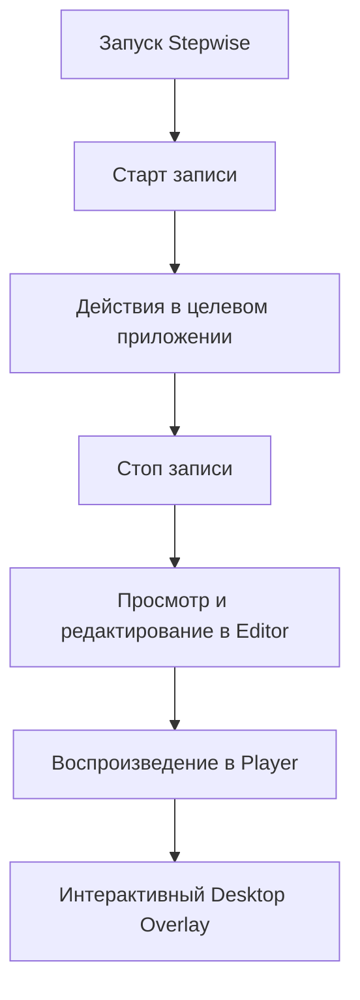

# Stepwise — Руководство пользователя (User Guide)

Добро пожаловать в **Stepwise** — нативную систему для создания интерактивных пошаговых руководств (Walkthrough Guides) по работе с приложениями Windows.

---

## 1. О программе

**Stepwise** автоматически отслеживает действия пользователя в реальных Windows-приложениях, захватывает скриншоты, собирает структурированную метаинформацию UI Automation (имена кнопок, типы контролов, идентификаторы, координаты) и формирует интерактивные руководства.

### Ключевые возможности:
- **Автоматическая запись**: фоновый перехват кликов мыши, ввода текста, прокрутки и горячих клавиш через низкоуровневые хуки Win32 без задержек интерфейса.
- **Интеллектуальный контекст**: привязка каждого действия к активному окну, процессу и элементу доступности (UIA).
- **Безопасность данных (Zero Password Leakage)**: автоматическое маскирование и подавление ввода паролей в защищенных полях (`PasswordBox`). Пароли никогда не сохраняются в открытом виде на диске.
- **Встроенный редактор (Guide Editor)**: просмотр захваченных скриншотов, редактирование названий и описаний шагов, инспекция технических метаданных.
- **Интерактивный плеер (Guide Player)**: пошаговое воспроизведение инструкций для человека с гибкой навигацией.
- **Прозрачный Desktop Overlay**: интерактивно-пассивная подсветка целевых элементов поверх реальных окон с эффектом «прожектора» (spotlight) и сквозным кликом (click-through) без перехвата фокуса.
- **100% Offline & Private**: полностью автономная работа на локальном ПК без обязательного интернета и без отправки пользовательских данных в облако.

---

## 2. Системные требования

- **Операционная система**: Windows 10 (версия 1809 / сборка 17763 и новее) или Windows 11 (x64 / ARM64).
- **Среда выполнения**: [.NET 9.0 Desktop Runtime](https://dotnet.microsoft.com/download/dotnet/9.0) (для framework-dependent запуска). В готовом Release-дистрибутиве библиотеки Windows App SDK уже включены.
- **Права доступа**:
  - Для работы с большинством стандартных программ достаточно обычных прав пользователя.
  - Для записи приложений, запущенных с правами администратора (Elevated/UAC), сам Stepwise должен быть запущен «От имени администратора».

---

## 3. Где найти билд и как запустить

### 3.1. Расположение исполняемых файлов
Собранный и готовый к запуску релизный пакет находится в директории:
```text
bin\publish\
```
Основной исполняемый файл:
```text
bin\publish\Stepwise.App.exe
```

### 3.2. Способы запуска

#### Вариант А: Обычный запуск через Проводник (GUI)
Дважды щелкните по `Stepwise.App.exe`. Приложение откроется и автоматически создаст/загрузит проект по умолчанию в каталоге:
```text
%LOCALAPPDATA%\Stepwise\DefaultProject\
```

#### Вариант Б: Запуск из командной строки (PowerShell / CMD)
Вы можете передать путь к пользовательской директории проекта через аргумент `--project`:
```powershell
# Запуск с указанием конкретной папки руководства
.\bin\publish\Stepwise.App.exe --project "C:\Guides\MyFirstGuide"
```
Также можно использовать переменную окружения:
```powershell
$env:STEPWISE_PROJECT_DIR = "C:\Guides\MyFirstGuide"
.\bin\publish\Stepwise.App.exe
```

---

## 4. Пошаговая инструкция по использованию



### Шаг 1. Запись нового руководства (Recording)

1. Запустите `Stepwise.App.exe`.
2. В верхней панели инструментов нажмите кнопку **«Старт»** (`BtnStartRecording`).
3. Индикатор состояния (`RecordingBadge`) загорится зеленым цветом и отобразит статус:
   > **`Запись активна...`**
4. Перейдите в приложение, для которого создается руководство (например, Блокнот, калькулятор, браузер или корпоративная программа), и выполняйте необходимые действия:
   - Кликайте по кнопкам и элементам меню;
   - Вводите текст в поля ввода;
   - Выбирайте пункты в списках.
5. При необходимости приостановить запись нажмите **«Пауза»** (`BtnPauseRecording`), а затем **«Продолжить»** (`BtnResumeRecording`).
6. После завершения действий вернитесь в Stepwise и нажмите **«Стоп»** (`BtnStopRecording`).
7. Статус перейдет в **`Запись завершена`**. Stepwise автоматически сформирует список шагов со скриншотами и сохранит их в локальную базу данных SQLite (`project.db`).

> [!NOTE]
> **Конфиденциальность ввода паролей**: Если вы вводите данные в поля типа «Пароль» (`PasswordBox`), Stepwise автоматически маскирует введенные символы (`••••••••`) или подавляет их запись. Исходные пароли никогда не попадут в базу данных, логи или метаданные.

---

### Шаг 2. Редактирование руководства (Guide Editor)

После остановки записи приложение отобразит экран **Редактора** (также доступен через левое меню **«Редактор»**):

1. **Список шагов (слева)**:
   - Отображает все распознанные шаги с миниатюрами скриншотов и типами действий (`LeftClick`, `TextInput` и др.).
   - Кликните по любому шагу для выбора.
2. **Область предпросмотра (по центру)**:
   - Показывает скриншот целевого экрана на момент действия.
   - Вокруг целевого элемента отображается аккуратная рамка подсветки.
   - В месте клика отображается круговой маркер.
   - Кнопка **«Подсветка»** позволяет переключать отображение контура и маркера.
3. **Панель сведений о шаге (справа)**:
   - **Заголовок (Title)**: понятное человекочитаемое название действия (например, *«Нажмите кнопку 'Войти'»*).
   - **Описание (Description)**: подробные пояснения к действию.
   - **Технические метаданные (Только чтение)**: имя элемента, тип элемента управления (`Button`, `Edit`), `AutomationId`, имя процесса, заголовок окна и экранные координаты.
4. Внесите необходимые изменения в тексты и нажмите кнопку сохранения шага. Все изменения сразу фиксируются в базе данных.

---

### Шаг 3. Воспроизведение в плеере (Guide Player)

Для запуска руководства нажмите кнопку **«Плеер»** (`BtnOpenPlayer`) в верхней панели или выберите пункт **«Плеер»** в навигационном меню:

1. Откроется окно плеера с визуальным стилем Windows 11 (Mica backdrop).
2. **Панель заголовка**:
   - Название руководства;
   - Статус готовности (`Готов`, `Воспроизведение`, `Пауза`, `Завершено`).
3. **Визуальный центр**:
   - Четкий скриншот с маркером целевого действия.
   - При отсутствии скриншота отображается понятное уведомление с кнопкой «Повторить попытку».
4. **Нижняя панель управления**:
   - Позиция шага: например, **`Шаг 1 из 4`**;
   - Заголовок и подробное описание действия;
   - Кнопка раскрытия технических метаданных элемента (`TargetMetadataPanel`).
5. **Кнопки управления воспроизведением**:
   - `|<` — перейти к первому шагу (`Home`);
   - `<` — предыдущий шаг (`Left Arrow`);
   - `▶ / ⏸` — воспроизведение / пауза (`Space`);
   - `↻` — начать заново с первого шага;
   - `>` — следующий шаг (`Right Arrow`);
   - `>|` — перейти к последнему шагу (`End`).

---

### Шаг 4. Интерактивный оверлей на рабочем столе (Desktop Overlay)

Desktop Overlay — это ключевая презентационная функция Stepwise, позволяющая просматривать руководство прямо поверх реального приложения, с которым работает пользователь:

1. В окне плеера нажмите кнопку **«Оверлей»** (переключатель на панели управления).
2. На экране активируется прозрачный слой:
   - **Spotlight-вырез**: область экрана за пределами целевого элемента мягко затемняется на 35%, а сам целевой элемент реальной программы остается **100% прозрачным и кристально четким**.
   - **Контур подсветки**: вокруг элемента выводится элегантная рамка акцентного цвета.
   - **Карточка-подсказка (Callout Card)**: темная карточка со стрелкой указывает на целевой элемент и отображает заголовок и инструкцию к текущему шагу.
   - **Умное позиционирование**: карточка автоматически выбирает оптимальное положение (справа $\to$ слева $\to$ снизу $\to$ сверху), чтобы не перекрывать элемент, и гарантированно не выходит за пределы экрана даже в мультимониторных конфигурациях.
3. **Сквозной клик (Hardware Click-Through)**:
   - Оверлей работает в режиме `WS_EX_TRANSPARENT`.
   - Вы можете кликнуть мышью **прямо сквозь оверлей** в кнопку или поле целевой программы — действие выполнится без перехвата фокуса оверлеем!
4. При переходе к следующему шагу (`Next` / `Right Arrow`) прожектор и карточка плавно перемещаются к следующему элементу.
5. Для отключения оверлея повторно нажмите кнопку **«Оверлей»** или просто закройте окно плеера.

---

## 5. Таблица горячих клавиш

| Клавиша | Контекст | Действие |
|---|---|---|
| <kbd>→</kbd> (Стрелка вправо) | Плеер | Перейти к следующему шагу |
| <kbd>←</kbd> (Стрелка влево) | Плеер | Перейти к предыдущему шагу |
| <kbd>Home</kbd> | Плеер | Перейти к первому шагу |
| <kbd>End</kbd> | Плеер | Перейти к последнему шагу |
| <kbd>Space</kbd> (Пробел) | Плеер | Переключить режим Воспроизведение / Пауза |
| <kbd>Esc</kbd> | Плеер | Закрыть окно плеера и скрыть оверлей |

---

## 6. Структура файлов проекта

Каждое руководство сохраняется в изолированном каталоге:
```text
<Каталог_Проекта>/
├── project.json              # Манифест руководства (GUID, наименование, дата создания)
├── project.db                # База данных SQLite (таблица steps, telemetry, UIA-параметры)
└── assets/
    └── screenshots/          # Скриншоты высокого разрешения (step_000.png, step_001.png, ...)
```

База данных и папка с ресурсами полностью автономны: чтобы перенести руководство на другой компьютер, достаточно скопировать папку проекта.

---

## 7. Часто задаваемые вопросы и диагностика (FAQ)

### ❓ Что делать, если на оверлее отображается «Целевой элемент недоступен»?
Это означает, что приложение, в котором производилась запись, в данный момент закрыто, свернуто или окно перемещено за пределы экрана. Оверлей при этом не падает с ошибкой, а выводит предупреждающую карточку. Как только окно приложения снова станет видимым, подсветка привяжется к элементу.

### ❓ Работает ли сквозной клик с окнами, запущенными от Администратора?
Если целевое приложение запущено с повышенными привилегиями (UAC / Run as Administrator), Windows по соображениям безопасности (UIPI — User Interface Privilege Isolation) блокирует получение сообщений ввода от непривилегированных процессов. В этом случае запустите `Stepwise.App.exe` также «От имени администратора».

### ❓ Поддерживаются ли несколько мониторов?
Да. Desktop Overlay автоматически определяет суммарные границы виртуального рабочего стола (`SM_XVIRTUALSCREEN`, `SM_YVIRTUALSCREEN`, `SM_CXVIRTUALSCREEN`, `SM_CYVIRTUALSCREEN`) и корректно обрабатывает отрицательные экранные координаты (например, если второй монитор расположен слева от основного).

### ❓ Как заново пересобрать билд из исходного кода?
Выполните команду в корне репозитория:
```powershell
# Сборка солюшена
dotnet build Stepwise.sln -c Release

# Публикация готового к распространению дистрибутива
dotnet publish src/Stepwise.App/Stepwise.App.csproj -c Release -r win-x64 -o bin/publish/
```

---

*Документация актуальна для Stepwise версии 2.6.0 (Phase 5 Stage 3 Complete).*
