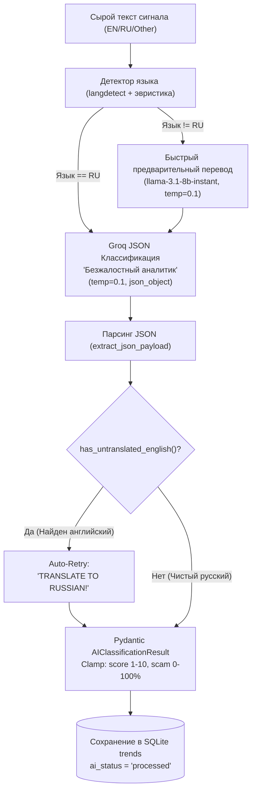

# 🤖 AI Engine, Translation & Deep Reports

> В данном документе описана архитектура аналитического интеллекта **TrendScanner**: интеграция с Groq Cloud API, предварительный динамический перевод через `langdetect`, двухуровневая система принудительного русского языка и генерация глубоких венчурных отчетов (Deep Reports).

Связанные разделы: [[Index]] | [[System_Pipeline]] | [[Database_Schema]] | [[Design_System_and_UI]] | [[API_Reference]]

---

## 🧠 Концепция: LLM как строгий классификатор

В архитектуре TrendScanner большие языковые модели (LLM) используются **не для свободных рассуждений**, а исключительно как **строгий детерминированный классификатор**.



---

## 🌐 1. Умный динамический перевод (`langdetect`)

Для повышения точности классификации тексты из англоязычных источников (Product Hunt, Reddit, Hacker News) проходят стадию предварительного языкового анализа.

1. **Функция `detect_language(text)`:**
   - Быстрый эвристический подсчет: если количество кириллических символов $>20$ и превышает латиницу, текст мгновенно признается русским (`"ru"`).
   - Если текст смешанный или латинский, вызывается библиотека `langdetect.detect()`.
2. **Предварительный перевод (`translate_to_russian`):**
   - Тексты на английском языке переводятся быстрым запросом через легковесную модель `llama-3.1-8b-instant`.
   - **Сохранение IT-терминов:** Промпт перевода строго предписывает сохранять оригинальные отраслевые термины, бренды и финансовые метрики (*SaaS, ARR, MRR, AI, Stripe, React, API, B2B, B2C, CRM*).

```text
TRANSLATION_SYSTEM_PROMPT = 
"Ты — профессиональный технический и бизнес-переводчик. Твоя единственная задача — 
точно и качественно перевести предложенный текст на русский язык, сохранив оригинальные 
IT-термины, названия продуктов, брендов и метрики (SaaS, ARR, MRR, AI, Stripe, React, API, B2B, B2C, CRM)."
```

---

## 🎯 2. Промпт классификатора: «Безжалостный аналитик»

Основная классификация выполняется через `SYSTEM_PROMPT` (`app/services/groq_client.py`), где зафиксированы строгие критерии:

```text
Ты — Безжалостный бизнес-аналитик и ИИ-классификатор трендов и микрониш.
Твоя единственная цель — беспристрастно анализировать входящие посты, статьи и обсуждения, 
отсекать инфошум, скам и пустые обещания, и выявлять реальные бизнес-возможности, 
микро-SaaS идеи и проверенные способы заработка.

КРИТИЧЕСКИЕ ПРАВИЛА ЯЗЫКА:
1. ПЕРЕВОД НА РУССКИЙ ОБЯЗАТЕЛЕН. ПОЛНОСТЬЮ И БЕЗ ИСКЛЮЧЕНИЙ!
2. ЗНАЧЕНИЯ ПОЛЕЙ `trend_name` И `ai_summary` ДОЛЖНЫ БЫТЬ НАПИСАНЫ СТРОГО НА РУССКОМ ЯЗЫКЕ!

Критерии оценки:
- is_trend (bool): true ТОЛЬКО если текст содержит реальный бизнес-кейс или микро-SaaS идею.
- trend_name (str): Лаконичное название ниши (2-5 слов НА РУССКОМ ЯЗЫКЕ).
- ai_score (int): Оценка жизнеспособности (1-3: мусор, 4-6: посредственно, 7-8: хороший тренд, 9-10: выдающаяся ниша).
- scam_probability (int): Оценка риска скама/накрутки от 0 до 100%.
- ai_summary (str): Сухая выжимка НА РУССКОМ ЯЗЫКЕ (суть продукта, кто платит, ключевые риски).
```

---

## 🛡️ 3. Детектор английского языка и Авто-Retry (`has_untranslated_english`)

Чтобы исключить попадание непереведенных фрагментов в интерфейс, разработан детектор `has_untranslated_english()`:
1. **Отсутствие кириллицы:** Если в `ai_summary` длиннее 8 символов нет ни одной русской буквы — флаг взводится.
2. **Английские маркеры начала предложений:** Проверка регулярным выражением (`The`, `This`, `In`, `We`, `It`, `There`, `When`, `Why`, `How`) при преобладании латиницы.
3. **Английские стоп-слова:** Поиск грамматических связок (`and`, `is`, `are`, `with`, `for`, `from`, `have`, `been`, `which`, `their`).
4. **Английские названия трендов:** Если `trend_name` содержит 3+ слова без кириллицы или английские предлоги (`for`, `and`, `with`, `in`).

### Механика Auto-Retry
Если детектор срабатывает:
1. Формируется контекст диалога с предыдущим ответом модели.
2. Отправляется корректирующее сообщение:
   > *"ОШИБКА: ТЫ ВЕРНУЛ АНГЛИЙСКИЙ ТЕКСТ! TRANSLATE TO RUSSIAN! ПЕРЕВОД НА РУССКИЙ ОБЯЗАТЕЛЕН. Переведи значения `trend_name` и `ai_summary` СТРОГО НА РУССКИЙ ЯЗЫК. Верни валидный JSON."*
3. Повторный ответ декодируется и повторно верифицируется.

---

## 📊 4. Генератор глубоких отчетов (Deep Reports)

Пользователь может запросить исчерпывающий аналитический отчет по любому тренду нажатием кнопки в модальном окне UI (или через `POST /api/v1/trends/{id}/report`).

### Структура отчета:
```markdown
### 🎯 1. Суть и ценность продукта
- В чем фундаментальная идея и какую главную боль клиентов решает продукт?
- Почему этот тренд актуален и растет прямо сейчас?

### 👥 2. Целевая аудитория и сегменты
- Кто конкретно является покупателем (B2B сегменты, соло-фаундеры, агентства, Prosumers)?
- Готовность платить (Willingness to Pay) и диапазон среднего чека / тарифных планов.

### ⚠️ 3. Риски и барьеры входа
- Уровень рыночной конкуренции и техническая сложность реализации.
- Потенциальные уязвимости и регуляторные риски.

### 🚀 4. План запуска MVP за 2 недели
- Пошаговый план быстрой проверки продуктовой гипотезы.
- Рекомендуемый технологический стек (no-code / low-code / FastAPI / React).

### 💰 5. Модель монетизации и юнит-экономика
- Основные потоки выручки (подписка, транзакционная комиссия, usage-based).
- Ожидаемая маржинальность и ориентировочные сроки окупаемости.
```

### Кэширование отчетов
Сгенерированный Markdown сохраняется в колонку `detailed_report` таблицы `trends` (см. [[Database_Schema]]). При повторном открытии отчет мгновенно отдается из БД без расхода токенов Groq API.

---

## ⚙️ 5. Конфигурация клиента Groq (`app/core/settings.py`)

| Параметр | Значение по умолчанию | Описание |
| :--- | :--- | :--- |
| `GROQ_API_KEY` | *(из `.env`)* | Секретный ключ авторизации Groq Cloud API. |
| `GROQ_MODEL` | `llama-3.1-8b-instant` | Базовая быстрая модель классификации. |
| `GROQ_MODEL_TRANSLATE` | `llama-3.1-8b-instant` | Модель для предварительного перевода. |
| `GROQ_MAX_RETRIES` | `3` | Количество попыток при сетевых сбоях и 429 ошибках. |
| `GROQ_RETRY_DELAY_SECONDS`| `2.0` | Базовая задержка для экспоненциального бэкоффа. |
| `GROQ_TIMEOUT_SECONDS` | `35.0` | Максимальный таймаут HTTP запроса. |
