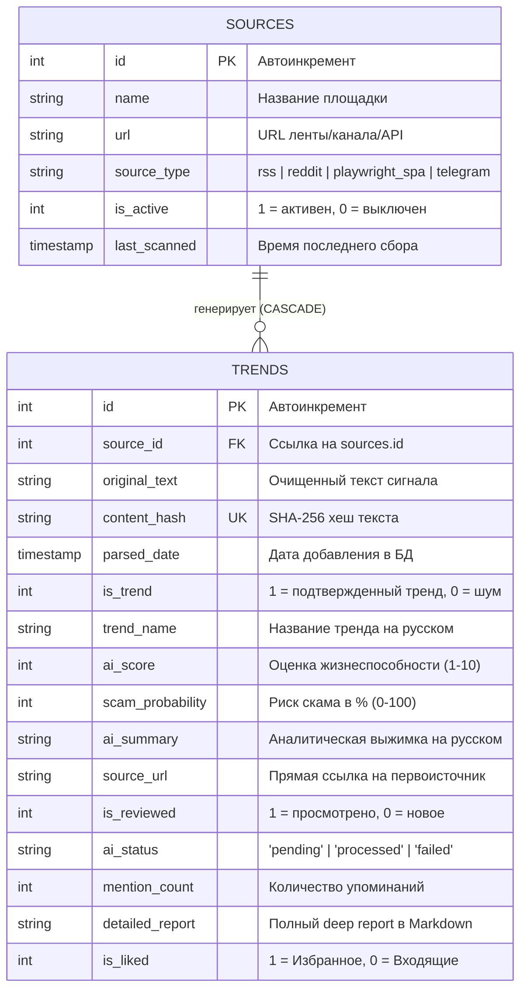

# 🗄️ Database Schema & Storage

> В данном документе приведена спецификация базы данных SQLite для **TrendScanner**: структура таблиц, индексы, конфигурация WAL-режима, механизмы миграций и CLI-утилита безопасной очистки устаревших записей.

Связанные разделы: [[Index]] | [[System_Pipeline]] | [[Parsers_and_Extractors]] | [[API_Reference]]

---

## ⚙️ Архитектурные принципы хранения (Local First & SQLite WAL)

TrendScanner построен по принципу **Self-Hosted / Local First** — система не зависит от внешних СУБД (PostgreSQL, MySQL), используя встраиваемый движок SQLite 3.

Для обеспечения высокой конкурентности, стабильной работы при одновременном чтении/записи и предотвращения блокировок базы (`sqlite3.OperationalError: database is locked`) используются следующие PRAGMA настройки:

```sql
PRAGMA foreign_keys = ON;      -- Контроль ссылочной целостности (каскадное удаление)
PRAGMA journal_mode = WAL;     -- Write-Ahead Logging (параллельное чтение без блокировки записи)
PRAGMA busy_timeout = 5000;    -- Автоматическое ожидание освобождения блокировки до 5 секунд
PRAGMA synchronous = NORMAL;   -- Оптимальный баланс надежности на диске и скорости в WAL
```

### Персистентность в Docker
Файл базы данных `trendscanner.db` и файл авторизационной сессии Telegram `trendscanner.session` монтируются через Docker Volume:
```yaml
volumes:
  - ./backend/data:/app/data
```
Это гарантирует полную сохранность накопленных трендов и авторизаций при перезапуске или пересборке контейнеров.

---

## 📊 ER-Диаграмма сущностей



---

## 📋 Описание таблиц

### 1. Таблица `sources` (Источники сбора)

Хранит конфигурацию 21 глобального источника для сбора информации.

| Поле | Тип данных | Nullable | Default | Описание |
| :--- | :--- | :--- | :--- | :--- |
| `id` | `INTEGER` | `NO` | PK AUTOINCREMENT | Уникальный идентификатор источника. |
| `name` | `TEXT` | `NO` | — | Человекочитаемое имя (например: `"Reddit /r/SaaS"`). |
| `url` | `TEXT` | `NO` | — | URL фида, API или веб-страницы. |
| `source_type` | `TEXT` | `NO` | — | Тип экстрактора (`rss`, `reddit`, `playwright_spa`, `telegram`). |
| `is_active` | `INTEGER` | `NO` | `1` | Флаг активности (`1` — опрашивать, `0` — пропустить). |
| `last_scanned` | `TIMESTAMP` | `YES` | `NULL` | Время последнего успешного сканирования (UTC). |

---

### 2. Таблица `trends` (Тренды и сигналы)

Основная аналитическая таблица системы.

| Поле | Тип данных | Nullable | Default | Описание |
| :--- | :--- | :--- | :--- | :--- |
| `id` | `INTEGER` | `NO` | PK AUTOINCREMENT | Уникальный ID записи. |
| `source_id` | `INTEGER` | `NO` | — | FK на `sources.id` (ON DELETE CASCADE). |
| `original_text` | `TEXT` | `NO` | — | Очищенный текст поста или обогащенный контекст со слиянием площадок. |
| `content_hash` | `TEXT` | `YES` | `NULL` | SHA-256 хеш содержимого для быстрой дедупликации (UNIQUE). |
| `parsed_date` | `TIMESTAMP` | `YES` | `CURRENT_TIMESTAMP` | Время попадания в базу данных. |
| `is_trend` | `INTEGER` | `NO` | `0` | Результат классификации ИИ (`1` — реальный бизнес-тренд, `0` — общий шум). |
| `trend_name` | `TEXT` | `YES` | `NULL` | Короткое название ниши на русском языке (2-5 слов). |
| `ai_score` | `INTEGER` | `YES` | `NULL` | Оценка коммерческого потенциала от `1` до `10`. |
| `scam_probability` | `INTEGER` | `YES` | `NULL` | Оценка риска скама/накрутки в процентах (`0-100`). |
| `ai_summary` | `TEXT` | `YES` | `NULL` | Краткое аналитическое резюме на русском языке. |
| `source_url` | `TEXT` | `YES` | `NULL` | Прямой URL на оригинальный пост/продукт. |
| `is_reviewed` | `INTEGER` | `NO` | `0` | Статус прочтения пользователем (`1` — прочитано/архив, `0` — новое). |
| `ai_status` | `TEXT` | `NO` | `'pending'` | Статус в очереди ИИ (`pending`, `processed`, `failed`). |
| `mention_count` | `INTEGER` | `NO` | `1` | Счетчик упоминаний данного тренда на разных площадках. |
| `detailed_report` | `TEXT` | `YES` | `NULL` | Полный аналитический венчурный отчет (Markdown). |
| `is_liked` | `INTEGER` | `NO` | `0` | Статус «Избранное» (`1` — в избранном, `0` — во входящих). |

---

## ⚡ Индексы производительности

Для мгновенной отдачи аналитических выборок, фильтрации по Inbox Zero и сортировки по дате/скору созданы следующие B-Tree индексы:

```sql
CREATE INDEX IF NOT EXISTS idx_trends_source_id ON trends(source_id);
CREATE INDEX IF NOT EXISTS idx_trends_content_hash ON trends(content_hash);
CREATE INDEX IF NOT EXISTS idx_trends_is_reviewed ON trends(is_reviewed);
CREATE INDEX IF NOT EXISTS idx_trends_ai_score ON trends(ai_score);
CREATE INDEX IF NOT EXISTS idx_trends_parsed_date ON trends(parsed_date);
CREATE INDEX IF NOT EXISTS idx_trends_ai_status ON trends(ai_status);
CREATE INDEX IF NOT EXISTS idx_trends_mention_count ON trends(mention_count);
CREATE INDEX IF NOT EXISTS idx_trends_is_liked ON trends(is_liked);
```

---

## 🔄 Инициализация и динамические миграции (`app/db/database.py`)

Функция `init_db(seed_default_sources=True)` вызывается при старте бэкенда FastAPI (`main.py` lifespan):
1. **Проверка схемы:** Если таблицы уже существуют, с помощью `PRAGMA table_info(trends)` проверяется наличие колонок `ai_status`, `mention_count`, `detailed_report`, `is_liked`. При их отсутствии автоматически выполняются безопасные `ALTER TABLE ADD COLUMN`.
2. **Безопасное сидирование:** Проверяется список источников `sources`. Если таблица пуста, вставляется 21 дефолтный источник. Если источники уже есть, добавляются только отсутствующие URL.

---

## 🧹 Утилита безопасной очистки базы данных (`app/db/cleanup.py`)

Для предотвращения разрастания базы при непрерывном сканировании реализован модуль безопасной очистки.

### Жесткие правила безопасности (Zero Data Loss Policy):
> [!IMPORTANT]
> **Лайкнутые тренды (`is_liked = 1`) НЕ УДАЛЯЮТСЯ НИКОГДА**, независимо от возраста!

1. Удаляются **только нелайкнутые** записи (`is_liked = 0` или `is_liked IS NULL`), дата которых старше заданного порога `--days` (по умолчанию 30 дней).
2. Автоматически очищаются осиротевшие промежуточные связи в связующих таблицах.
3. Операция выполняется в единой транзакции с возвратом количества удаленных записей.

### CLI использование:
```bash
# Запуск очистки трендов старше 30 дней (по умолчанию)
python -m app.db.cleanup --days 30

# Запуск с указанием кастомного пути к БД и порога в 14 дней
python -m app.db.cleanup --days 14 --db-path /app/data/trendscanner.db
```

### Программный интерфейс (Python API):
```python
from app.db.cleanup import cleanup_old_unliked_trends

# Удалить нелайкнутые тренды старше 45 дней
deleted_count = cleanup_old_unliked_trends(days=45)
print(f"Удалено {deleted_count} устаревших трендов.")
```
