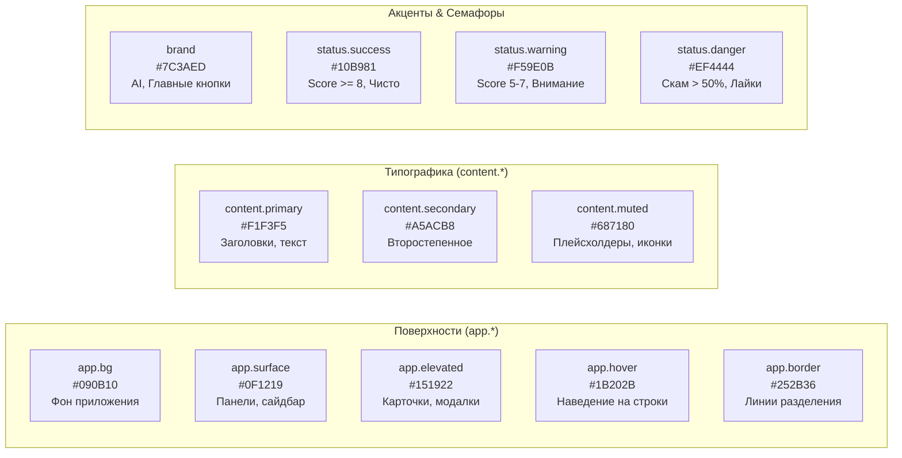

# 🎨 Design System & SaaS UI Architecture

> В данном документе представлена спецификация фронтенда и дизайн-системы **TrendScanner**: холодная высококонтрастная сине-серая палитра, Soft UI семафоры, архитектура компонентов Topbar и Sidebar, концепция **Inbox Zero** и таймер обратного отсчета.

Связанные разделы: [[Index]] | [[System_Pipeline]] | [[AI_Engine_and_Translation]] | [[API_Reference]]

---

## 💎 Философия визуального языка

Интерфейс TrendScanner спроектирован как **высокоплотный финансово-аналитический терминал**:
- **Минимум визуального шума:** Отсутствие тяжелых градиентов, лишних теней и отвлекающих анимаций.
- **Информационная плотность:** Максимум полезных данных на экран без необходимости лишнего скролла.
- **Мгновенный отклик (Optimistic UI):** Действия пользователя (лайк, пометка прочитанным) применяются в интерфейсе мгновенно до завершения сетевого запроса.
- **Семафорная логика:** Цвет используется исключительно для смысловой индикации риска и коммерческого потенциала.

---

## 🎨 Цветовая палитра (`tailwind.config.js`)

Вся верстка базируется на семантических CSS/Tailwind токенах `app`, `content`, `brand`, `status`:

### Спецификация токенов:

| Токен Tailwind | HEX код | Назначение |
| :--- | :--- | :--- |
| `bg-app-bg` | `#090B10` | Основной глубокий темный фон рабочей области. |
| `bg-app-surface` | `#0F1219` | Фон плашек Topbar, Sidebar и модальных окон. |
| `bg-app-elevated` | `#151922` | Карточки, бейджи, поля ввода и контейнеры списков. |
| `bg-app-hover` | `#1B202B` | Состояние наведения на строки таблицы и кнопки. |
| `border-app-border` | `#252B36` | Тонкие границы разделения блоков и таблиц. |
| `text-content-primary` | `#F1F3F5` | Высококонтрастный текст для заголовков и важных значений. |
| `text-content-secondary`| `#A5ACB8` | Основной текст описаний и аналитических выжимок. |
| `text-content-muted` | `#687180` | Мелкие подписи, время, плейсхолдеры и разделители. |
| `bg-brand` | `#7C3AED` | Фирменный фиолетовый цвет кнопки «Сканировать» и ИИ-акцентов. |
| `bg-brand-hover` | `#8B5CF6` | Наведение на интерактивные бренд-элементы. |
| `text-status-success` | `#10B981` | Семафор: высокий скор ($\ge 8$), низкий риск скама ($< 20\%$). |
| `text-status-warning` | `#F59E0B` | Семафор: средний скор ($5-7$), умеренный риск ($20-50\%$). |
| `text-status-danger` | `#EF4444` | Семафор: высокий риск ($> 50\%$), ошибки, сердечки лайков. |

---

## 🚦 Soft UI Семафоры (`components/Badges.tsx`)

### 1. Бейдж AI Score (`ScoreBadge`)
- **$\ge 8/10$:** `bg-status-success/10 text-status-success border-status-success/20` с зеленой точкой.
- **$5-7/10$:** `bg-status-warning/10 text-status-warning border-status-warning/20` с желтой точкой.
- **$< 5/10$:** `bg-app-hover text-content-muted border-app-border`.

### 2. Бейдж Scam Risk (`ScamBadge`)
- **$> 50\%$:** `bg-status-danger/10 text-status-danger border-status-danger/20` (`ShieldAlert`).
- **$20-50\%$:** `bg-status-warning/10 text-status-warning border-status-warning/20` (`AlertTriangle`).
- **$< 20\%$:** `bg-status-success/10 text-status-success border-status-success/20` (`ShieldCheck`).

---

## 🖥️ Ключевые компоненты интерфейса

### 1. Шапка терминала (`components/Topbar.tsx`)
Topbar содержит статус системы, живой таймер и элементы управления:
- **Логотип и бренд:** Моноширинный индикатор `TRENDSCANNER v1.0`.
- **Строка статуса Радара (кликабельная):**
  `Радар: 21 источник • В очереди ИИ: 0 • Посл. скан: 18:50 (сегодня) • Следующий скан через: MM:SS`
- **Живой таймер обратного отсчета (`calculateTimeLeft`):**
  - Получает `next_scan_time` напрямую из APScheduler через API.
  - Каждую секунду обновляет отображение (`MM:SS` или `HH:MM:SS`).
  - Оснащен защитой от утечек памяти (`clearInterval` в `useEffect`).
  - По истечении времени автоматически запускает фоновое обновление данных `onRefresh()`.
- **Счетчики Inbox Zero:** Лаконичные виджеты «Входящие» и «Избранное».
- **Кнопки управления:** Иконка принудительного обновления и кнопка «Сканировать» (`bg-brand`).

---

### 2. Боковая панель фильтрации (`components/Sidebar.tsx`)
Устранено дублирование навигации — сайдбар объединяет фильтры и разделы:
1. **Единый блок навигации:**
   - 📥 **Входящие** (`tab=inbox`): нелайкнутые и необработанные сигналы.
   - ❤️ **Избранное** (`tab=liked`): сохраненные фаундером тренды.
   - 📦 **Архив** (`status=reviewed`): просмотренные материалы.
2. **Поиск:** Живой фильтр по названию и ключевым словам с кнопкой очистки `X`.
3. **Переключатель «Только тренды»:** Тумблер для мгновенного отсечения инфошума (`is_trend = 1`).
4. **Сетка минимального скора ИИ:** Быстрые кнопки (`Все`, `≥ 5`, `≥ 7`, `≥ 8`).
5. **Сетка максимального риска скама:** Кнопки (`Все`, `≤ 50%`, `≤ 20%`).

---

### 3. Таблица трендов & Inbox Zero (`components/TrendsGrid.tsx`)

Реализует концепцию **Inbox Zero**:
- По умолчанию в разделе «Входящие» отображаются только нелайкнутые записи.
- Нажатие на кнопку сердечка ❤️ мгновенно переносит тренд в «Избранное» с эффектом Optimistic UI (запись плавно исчезает из входящих).
- Клик по строке открывает модальное окно подробного просмотра.

---

### 4. Модальные окна

#### Детальный просмотр тренда (`components/TrendDetailModal.tsx`)
- Полный текст первоисточника с подсветкой ссылок.
- Метрики виральности: `mention_count`, дата, платформа.
- **Интерактивная кнопка генерации Deep Report:** по нажатию обращается к `POST /api/v1/trends/{id}/report` и рендерит структурированный план запуска MVP.

#### Мониторинг источников (`components/SourcesModal.tsx`)
- Обзор всех 21 площадки с группировкой по категориям:
  - *Playwright SPA (2)*
  - *RSS / Atom Feeds (6)*
  - *Reddit JSON API (7)*
  - *Telegram MTProto & Web Preview (6)*
- Время последнего сбора и индикатор активности.
