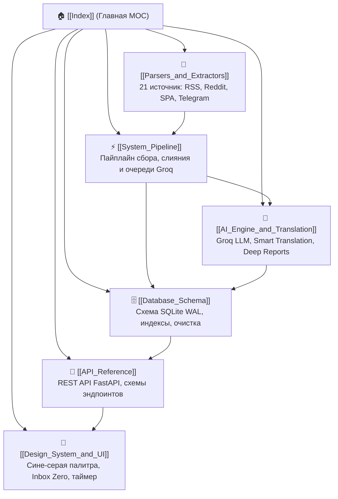

# 🧠 TrendScanner: Map of Content (MOC)

> **TrendScanner** — автономный локальный аналитический терминал для непрерывного мониторинга, интеллектуальной фильтрации, дедупликации и ИИ-оценки бизнес-трендов, микрониш и Micro-SaaS продуктов.

Система собирает сырые данные из 21 глобального источника (RSS, Reddit JSON, Playwright SPA, Telegram MTProto), проводит строгую эвристическую очистку и многоуровневую дедупликацию, а затем оценивает коммерческий потенциал через Groq Cloud LLM (*Llama-3.1-8b-instant*) со 100% переводом на русский язык.

---

## 🗺️ Карта архитектуры и разделы базы знаний



---

## 📚 Разделы документации

| Раздел | Документ | Описание |
| :--- | :--- | :--- |
| **01. Пайплайн & Оркестрация** | [[System_Pipeline]] | Архитектура сбора данных, санитизация спама, движок умной дедупликации со слиянием контекста, троттлинг-очередь Groq и фоновые задачи APScheduler. |
| **02. Хранилище данных** | [[Database_Schema]] | Спецификация SQLite базы данных в режиме WAL, индексы, связи таблиц `sources` и `trends`, миграции и CLI-утилита безопасной очистки нелайкнутых записей. |
| **03. Экстракторы & Радар** | [[Parsers_and_Extractors]] | Детальный обзор 21 источника данных: парсинг RSS/Atom, прямой Reddit JSON API, Headless Chrome (Playwright) для SPA и Telethon MTProto / Web Preview для Telegram. |
| **04. ИИ-Ядро & Перевод** | [[AI_Engine_and_Translation]] | Интеграция с Groq API, предварительный динамический перевод через `langdetect`, промпт «Безжалостный аналитик», авто-повторы и генерация глубоких отчетов (Deep Reports). |
| **05. Интерфейс & Дизайн** | [[Design_System_and_UI]] | Кастомная высококонтрастная палитра Tailwind (`app`/`content`/`brand`/`status`), логика Soft UI семафоров, Topbar с живым таймером, Sidebar с навигацией Inbox Zero. |
| **06. Спецификация API** | [[API_Reference]] | Полная документация REST API FastAPI (`/api/v1`): эндпоинты трендов, лайков, источников, генерации отчетов, ручного сканирования и системного статуса. |

---

## 🛠️ Технологический стек

```text
TrendScanner Stack:
├── Backend:
│   ├── Framework: FastAPI (Python 3.11+)
│   ├── Storage: SQLite 3 (WAL Mode + Busy Timeout + Foreign Keys)
│   ├── Scheduler: APScheduler (AsyncIOScheduler)
│   ├── Scraping: Playwright (Chromium Headless), Telethon (MTProto), HTTPX, BeautifulSoup4
│   ├── AI & NLP: Groq Cloud API (Llama-3.1-8b-instant), langdetect, difflib
│   └── Validation: Pydantic v2, Settings (Pydantic-Settings)
├── Frontend:
│   ├── Library: React 18 (TypeScript)
│   ├── Build Tool: Vite
│   ├── Styling: Tailwind CSS (Custom Dark Cold Theme)
│   ├── Icons: Lucide React
│   └── Architecture: Optimistic UI, Inbox Zero Pattern
└── Infrastructure:
    ├── Containerization: Docker & Docker Compose
    └── Persistence: Docker Volumes (SQLite DB, Telegram Sessions)
```

---

## 🧭 Быстрая навигация по ключевым сценариям

1. **Как работает сбор и слияние трендов?** → Читайте [[System_Pipeline]] и [[Parsers_and_Extractors]].
2. **Как устроена структура БД и как очистить старые тренды?** → Читайте [[Database_Schema]].
3. **Как ИИ классифицирует сигналы и переводит их на русский язык?** → Читайте [[AI_Engine_and_Translation]].
4. **Как устроена дизайн-система и концепция Inbox Zero?** → Читайте [[Design_System_and_UI]].
5. **Как интегрироваться с бэкендом через HTTP?** → Читайте [[API_Reference]].

---

## 📁 Дополнительные каталоги

- **Заметки по исследованию трендов:** `TrendScanner_Vault/02_Trends/`
