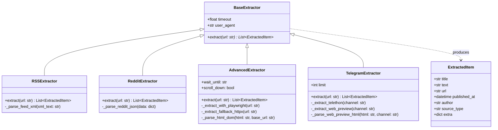

# 📡 Parsers and Extractors

> В данном документе детально описана архитектура слоя сбора данных **TrendScanner**: базовый интерфейс экстракторов, реестр провайдеров и спецификация всех **21 подключенных источников**, разделенных на 4 технологических типа.

Связанные разделы: [[Index]] | [[System_Pipeline]] | [[Database_Schema]] | [[AI_Engine_and_Translation]]

---

## 🏗️ Архитектура слоя сбора данных

Все парсеры наследуются от единого абстрактного базового класса `BaseExtractor` (`app/services/extractors/base.py`) и возвращают стандартизированные объекты `ExtractedItem`.



### Реестр экстракторов (`EXTRACTOR_REGISTRY`)
Фабричный метод `get_extractor(source_type: str)` автоматически инстанцирует необходимый парсер:
```python
EXTRACTOR_REGISTRY = {
    "rss": RSSExtractor,
    "reddit": RedditExtractor,
    "playwright_spa": AdvancedExtractor,
    "spa": AdvancedExtractor,
    "advanced": AdvancedExtractor,
    "telegram": TelegramExtractor,
    "telegram_channel": TelegramExtractor,
    "telegram_html": TelegramExtractor,
}
```

---

## 🌐 Каталог 21 источника данных

### 1. SPA & Headless Chrome (Playwright Chromium)
*Экстрактор:* `AdvancedExtractor` (`app/services/extractors/advanced_extractor.py`)  
*Технология:* Полноценный headless-браузер Chromium, инъекция stealth-скриптов для сокрытия автоматизации (`navigator.webdriver = undefined`), имитация скролла, умный парсинг DOM-карточек с fallback на асинхронный `httpx`.

| # | Название источника | URL | Тип парсера | Описание |
| :-: | :--- | :--- | :--- | :--- |
| **1** | **Product Hunt Trending (SPA)** | `https://www.producthunt.com/` | `playwright_spa` | Ежедневные запуски и трендовые продукты Product Hunt. |
| **2** | **Indie Hackers Products (SPA)** | `https://www.indiehackers.com/products` | `playwright_spa` | Каталог новых Micro-SaaS продуктов независимых фаундеров. |

```javascript
// Stealth JavaScript injection для обхода Cloudflare / Anti-bot
Object.defineProperty(navigator, 'webdriver', { get: () => undefined });
Object.defineProperty(navigator, 'languages', { get: () => ['en-US', 'en'] });
```

---

### 2. RSS & Atom Feeds
*Экстрактор:* `RSSExtractor` (`app/services/extractors/rss_extractor.py`)  
*Технология:* Асинхронный HTTPX с распаковкой XML/Atom, декодированием CDATA блоков, очисткой разметки и нормализацией ссылок.

| # | Название источника | URL | Тип парсера | Описание |
| :-: | :--- | :--- | :--- | :--- |
| **3** | **Hacker News Best** | `https://news.ycombinator.com/rss` | `rss` | Лучшие материалы и дискуссии Hacker News. |
| **4** | **Hacker News Show HN** | `https://hnrss.org/show` | `rss` | Презентации новых стартапов и пет-проектов (Show HN). |
| **5** | **TechCrunch Startups** | `https://techcrunch.com/category/startups/feed/` | `rss` | Официальная лента новостей венчурного рынка и раундов. |
| **6** | **Medium: SaaS** | `https://medium.com/feed/tag/saas` | `rss` | Экспертные статьи по SaaS-бизнесу, метрикам и архитектуре. |
| **7** | **Medium: Startups** | `https://medium.com/feed/tag/startup` | `rss` | Опыт фаундеров, истории роста и кейсы запуска. |
| **8** | **Medium: AI** | `https://medium.com/feed/tag/artificial-intelligence` | `rss` | Новые разработки, инструменты и бизнес-применения ИИ. |

---

### 3. Reddit JSON API
*Экстрактор:* `RedditExtractor` (`app/services/extractors/reddit_extractor.py`)  
*Технология:* Запросы к официальному открытому JSON API Reddit (`/hot.json?limit=25`) с кастомными User-Agent заголовками, извлечением `selftext`, кармы и ссылок на дискуссии.

| # | Название источника | URL | Тип парсера | Описание |
| :-: | :--- | :--- | :--- | :--- |
| **9** | **Reddit /r/SaaS** | `https://www.reddit.com/r/SaaS/hot.json?limit=25` | `reddit` | Сообщество создателей SaaS, метрики ARR, маркетинг. |
| **10** | **Reddit /r/Entrepreneur** | `https://www.reddit.com/r/Entrepreneur/hot.json?limit=25` | `reddit` | Бизнес-идеи, валидация гипотез и истории заработка. |
| **11** | **Reddit /r/startups** | `https://www.reddit.com/r/startups/hot.json?limit=25` | `reddit` | Вопросы поиска product-market fit и привлечения инвестиций. |
| **12** | **Reddit /r/SideProject** | `https://www.reddit.com/r/SideProject/hot.json?limit=25` | `reddit` | Демонстрации пет-проектов и микро-сервисов. |
| **13** | **Reddit /r/GrowthHacking** | `https://www.reddit.com/r/GrowthHacking/hot.json?limit=25` | `reddit` | Связки привлечения трафика, лидогенерация и виральность. |
| **14** | **Reddit /r/Flipping** | `https://www.reddit.com/r/Flipping/hot.json?limit=25` | `reddit` | Арбитраж, перепродажа и поиск недооцененных ниш. |
| **15** | **Reddit /r/technology** | `https://www.reddit.com/r/technology/hot.json?limit=25` | `reddit` | Глобальные технологические тренды и новости индустрии. |

---

### 4. Telegram MTProto & Web Preview
*Экстрактор:* `TelegramExtractor` (`app/services/extractors/telegram_extractor.py`)  
*Технология:* Двухуровневый сбор:
1. **Первичный протокол:** Асинхронный клиент **Telethon MTProto** с постоянной сессией (`trendscanner.session`) в Docker volume.
2. **Отказоустойчивый Fallback:** Парсинг публичного веб-интерфейса `https://t.me/s/{channel}` через HTTPX и BeautifulSoup с извлечением текста, дат публикации и авторов.

| # | Название источника | URL / Канал | Тип парсера | Описание |
| :-: | :--- | :--- | :--- | :--- |
| **16** | **Telegram: Tech Trends** | `https://t.me/tech_trends` | `telegram` | Тренды технологий и софтверных продуктов. |
| **17** | **Telegram: AI & SaaS Radar** | `https://t.me/ai_startups_radar` | `telegram` | Радар стартапов в сфере искусственного интеллекта. |
| **18** | **Telegram: @startupoftheday** | `https://t.me/startupoftheday` | `telegram` | Ежедневный разбор интересных стартапов от Александра Горного. |
| **19** | **Telegram: @the_hustle_ru** | `https://t.me/the_hustle_ru` | `telegram` | Бизнес-идеи, тренды и предпринимательские кейсы. |
| **20** | **Telegram: @ycombinator_ru** | `https://t.me/ycombinator_ru` | `telegram` | Переводы и инсайты из экосистемы Y Combinator. |
| **21** | **Telegram: Tech News Feed** | `https://t.me/technews_daily` | `telegram` | Оперативная хроника IT-индустрии и софтверных релизов. |

---

## 🛡️ Отказоустойчивость и безопасность экстракции

1. **Изолированные таймауты:** Каждый экстрактор имеет собственный таймаут (от 15 до 25 секунд). Падение или блокировка одного источника не блокирует весь цикл сбора.
2. **Нормализация каналов Telegram:** Поддерживаются любые форматы ввода (`@channel`, `https://t.me/channel`, `t.me/s/channel`).
3. **Автоматический Fallback:** Если Playwright не установлен в тестовом окружении, `AdvancedExtractor` автоматически переключается на `httpx`. Если Telethon не авторизован, `TelegramExtractor` мгновенно парсит публичный Web Preview.
