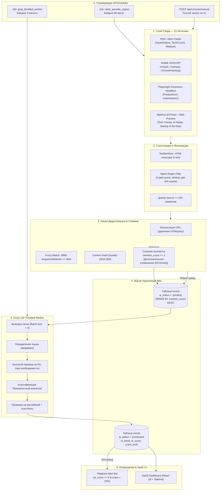

# ⚡ System Pipeline Architecture

> Данный документ описывает сквозной жизненный цикл данных в системе **TrendScanner**: от опроса 21 источника и предварительной очистки текста до умной дедупликации, троттлинг-очереди Groq LLM и мгновенных Telegram Push-алертов.

Связанные разделы: [[Index]] | [[Database_Schema]] | [[Parsers_and_Extractors]] | [[AI_Engine_and_Translation]] | [[API_Reference]]

---

## 🏗️ Общая диаграмма пайплайна



---

## 🔄 Пошаговые этапы обработки данных

### Этап 1: Сбор данных (Data Ingestion)
Сбор данных инициируется модулем `PipelineManager.ingest_all_sources()`:
1. Запрашиваются все активные источники из таблицы `sources` (`is_active = 1`).
2. Для каждого источника по `source_type` фабрика `get_extractor()` подбирает подходящий парсер (подробнее в [[Parsers_and_Extractors]]):
   - `RSSExtractor`
   - `RedditExtractor`
   - `AdvancedExtractor` (Playwright Headless Chrome)
   - `TelegramExtractor` (Telethon MTProto + Web Preview)
3. Извлекаются сырые объекты `ExtractedItem` (заголовок, сырой текст, URL первоисточника, дата публикации, автор).

### Этап 2: Санитизация и защита от спама (`TextSanitizer`)
Перед сохранением каждый текст проходит строгую нормализацию в классе `TextSanitizer` (`app/services/sanitizer.py`):
- **Декодирование сущностей:** `html.unescape()` переводит `&amp;`, `&lt;`, `&quot;` в стандартные символы.
- **Очистка HTML/Markdown разметки:** удаляются неконтентные теги (`<script>`, `<style>`, `<nav>`, `<footer>`) и нормализуются markdown-ссылки.
- **Unicode нормализация:** преобразование NFKC, удаление невидимых управляющих символов и Zero-Width пробелов (`\u200B-\u200D`, `\uFEFF`).
- **Фильтрация по длине:** посты короче `MIN_TEXT_LENGTH` (по умолчанию 100 символов) отсекаются с причиной `too_short`.
- **Эвристический антиспам:** регулярные выражения отсекают крипто-накрутки, памп-группы, бесплатные аирдропы, обещания 100% доходности и призывы в закрытые VIP-каналы.

```python
# Примеры спам-паттернов sanitizer:
DEFAULT_SPAM_PATTERNS = [
    r"\bcrypto\s*pump\b",
    r"\bfree\s*airdrop[s]?\b",
    r"\bguaranteed\s*profit[s]?\b",
    r"\b100x\s*(?:gem|potential)\b",
    r"\bjoin\s*(?:our\s*)?telegram\b",
    r"гарантированн(?:ая|ый|ое)\s*доход",
]
```

---

### Этап 3: Движок умной дедупликации и слияния (`DeduplicationEngine`)
Чтобы исключить размножение одинаковых новостей и отслеживать виральность тем, реализован двухуровневый движок дедупликации (`app/services/deduplicator.py`):

1. **Нормализация и канонизация URL (`normalize_url`):**
   - Приведение протокола к `https://`, lowercase для домена и путей.
   - Удаление префикса `www.` и стандартных портов.
   - Вырезание трекинговых меток: `utm_*`, `ref`, `referrer`, `source`, `fbclid`, `gclid`, `twclid`, `igshid`, `_hsenc`.
   - Игнорирование общих корневых страниц и фидов (Reddit root, HN root, Product Hunt root).
2. **Точное хеш-сравнение:**
   - Вычисление SHA-256 хеша очищенного текста.
3. **Fuzzy-сравнение текстов и заголовков:**
   - Алгоритм `difflib.SequenceMatcher(None, s1, s2).ratio()`.
   - Порог схожести: $\ge 0.85$ (85%). Сравниваются как заголовки, так и первые 500 символов текстов.
4. **Слияние дубликатов (Merge & Multi-mention Counter):**
   - Если дубликат найден в базе или в текущей пачке:
     - Запись **не дублируется**.
     - Инкрементируется счетчик упоминаний: `mention_count = mention_count + 1`.
     - К тексту существующего тренда дописывается контекст со второй площадки:
       ```text
       [Дополнительное упоминание (Reddit /r/SaaS)]:
       <текст комментария или поста со второй площадки>
       ```

---

### Этап 4: SQLite Pending Queue
Новые валидные и уникальные сигналы сохраняются в базу данных [[Database_Schema]] со статусом:
- `ai_status = 'pending'`
- `is_trend = 0`
- `mention_count = 1`

Очередь выстроена с приоритизацией виральных тем:
```sql
SELECT * FROM trends
WHERE ai_status = 'pending'
ORDER BY mention_count DESC, id ASC
LIMIT 3;
```

---

### Этап 5: Троттлинг-воркер Groq LLM (`process_groq_queue`)
Воркер классификации работает асинхронно с защитой от блокировок через `asyncio.Lock()`:
1. Выбирает пачку из 3 записей со статусом `pending`.
2. Проверяет язык через `langdetect` и при необходимости запускает быстрый перевод на русский язык.
3. Отправляет запрос в Groq API (*Llama-3.1-8b-instant*) с системным промптом классификатора (см. [[AI_Engine_and_Translation]]).
4. Проверяет ответ на наличие непереведенного английского текста.
5. Записывает результат в БД: `ai_status = 'processed'`, `is_trend`, `ai_score`, `scam_probability`, `ai_summary`.

#### Защита от Rate Limit (HTTP 429 & 5xx Backoff)
При получении ошибки `429 Too Many Requests`:
- Воркер извлекает заголовок `Retry-After` (или берет экспоненциальный бэкофф).
- Засыпает на 60 секунд (`await asyncio.sleep(60)`), защищая лимиты токенов Groq RPM/TPM.
- Прерывает текущий батч без потери данных: необработанные записи остаются в статусе `pending` до следующего цикла.

---

### Этап 6: Telegram Push-Алерты (`TelegramNotifier`)
Для мгновенного уведомления о топ-возможностях модуль `TelegramNotifier` (`app/services/notifier.py`) отправляет форматированное HTML-сообщение в Telegram-чат:
- **Критерии срабатывания:** `ai_score >= 9` **И** `scam_probability < 15%`.
- Сообщение содержит название ниши, скор, риск скама, счетчик упоминаний (если $>1$), аналитическое резюме и прямую ссылку на первоисточник.

---

### Этап 7: Фоновые задачи APScheduler (`app/workers/scheduler.py`)

| Job ID | Интервал | Функция | Назначение |
| :--- | :--- | :--- | :--- |
| `radar_periodic_ingest` | 60 минут | `scheduled_radar_job()` | Опрос всех 21 активных источников, санитизация, дедупликация и наполнение очереди. |
| `groq_throttled_worker` | 3 минуты | `scheduled_groq_worker_job()` | Порционная классификация 3 трендов из очереди `pending` через Groq API. |

---

## 🔒 Изоляция и потокобезопасность

1. **Locks в памяти:** `PipelineManager` использует `_ingest_lock` и `_groq_lock`, исключая параллельные наложения одинаковых задач.
2. **Busy Timeout SQLite:** Соединения SQLite используют `busy_timeout = 5000` мс и режим `WAL`, позволяя одновременно писать воркеру и читать API серверу (подробнее в [[Database_Schema]]).
3. **Optimistic UI:** На фронтенде любые изменения (лайки, чтение) отображаются мгновенно и синхронизируются в фоне через [[API_Reference]].
