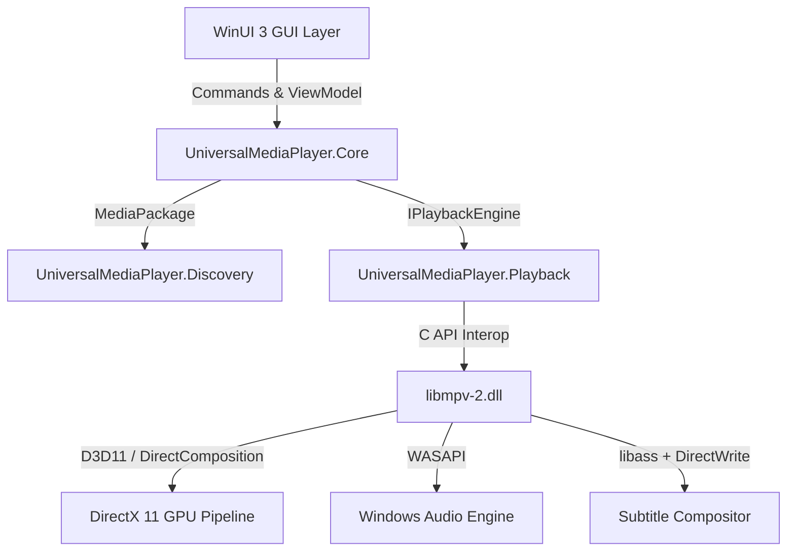

# Universal Media Player — Product & Architectural Specification

> **Status:** Active Source of Truth  
> **Version:** 1.0.0  
> **Last Updated:** 2026-09-05  
> **Platform Target:** Windows 10 (1809+) / Windows 11 (x64, ARM64)  
> **Primary Engine:** `libmpv` (libmpv-2.dll)  
> **UI Stack:** C# 12 / .NET 8/9 / WinUI 3 (Windows App SDK)  

---

## 1. Project Vision

Universal Media Player is a lightweight, local-first Windows media player engineered to deliver maximum playback compatibility across modern, legacy, and exotic media formats, combined with an intelligent understanding of multi-file media releases.

### The Core Paradigm Shift
Traditional media players operate on a primitive model:
```
FILE → PLAY
```
Universal Media Player operates on a media-release package model:
```
FILE
  ↓
UNDERSTAND MEDIA (Directory, Sibling Files, Audio, Subtitles, Fonts, Episodes)
  ↓
BUILD MEDIA PACKAGE (Aggregate Root combining all related streams)
  ↓
SELECT BEST TRACKS (Based on deterministic score-matching and user preferences)
  ↓
PLAY (Flawless hardware-accelerated playback with full styling & external sync)
```

---

## 2. Product Goals

1. **Broadest Possible Format Compatibility:** Seamless playback of modern (AV1, HEVC, VP9, MKV), legacy (AVI, WMV, DivX, XviD, RealMedia, MPEG-1/2), audio-only (FLAC, MKA, ALAC, Opus, MP3), and disc formats (DVD ISO/VOB, Blu-ray BDMV) without installing third-party codec packs.
2. **First-Class Media Release Understanding:** Automatically identify and pair external audio streams (`.mka`, `.ac3`, `.flac`), external subtitles (`.ass`, `.srt`, `.vtt`), and external font bundles (`fonts/*.ttf`, `fonts/*.otf`) with the active video file.
3. **Instantaneous Startup & Lightweight Footprint:** Cold launch in `< 150 ms`, playback start in `< 100 ms`, and idle memory usage `< 60 MB`.
4. **Keyboard-First, Distraction-Free UX:** Inspired by Light Alloy 4.11.2, every playback control and navigation action is accessible via single-key or standard keyboard shortcuts; the video canvas is uncluttered, with auto-hiding micro-controls and contextual flyouts.
5. **Local-First & Absolute Privacy:** 100% offline, zero cloud dependencies, zero user telemetry, zero background network calls.
6. **Smart Episodic Continuity:** Automatic recognition of season/episode sequences with persistent audio/subtitle preferences carried forward across consecutive episodes.

---

## 3. Non-Goals

The following capabilities are explicitly outside the scope of Universal Media Player:
- **No Cloud / Streaming Service:** No accounts, authentication, cloud sync, or server hosting.
- **No Torrent / P2P Client:** Not a BitTorrent client; does not download media files.
- **No Heavy Media Center (Not Kodi / Plex):** No bloated TV-dashboard interfaces, remote couch scrapers, or poster wall databases that introduce bloat.
- **No Online Metadata Scraping:** No unrequested network requests to IMDb, TMDB, or TVDB for baseline playback. All release understanding is derived purely from local filenames, folder trees, and bitstream metadata.
- **No Web / Cross-Platform Target:** Strictly tailored for native Windows desktop (Win32 / Windows App SDK).
- **No AI Chatbot Integration:** No embedded conversational agents within the runtime player interface.

---

## 4. Target Platform

- **Operating System:** Windows 10 (version 1809 / build 17763 or higher) and Windows 11 (all versions).
- **Architecture:** `win-x64` (primary) and `win-arm64` (native ARM compilation).
- **Application Framework:** .NET 8 / .NET 9 LTS/STS runtime (`Microsoft.WindowsDesktop.App`).
- **UI Platform:** Windows App SDK (WinUI 3) utilizing XAML, DirectComposition, and native HWND swapchain hosting.
- **Graphics Pipeline:** Direct3D 11 (`d3d11.dll`) with DXGI Flip Model presentation (`DXGI_SWAP_EFFECT_FLIP_DISCARD`), DirectWrite for typography, and hardware decoding via D3D11VA / DXVA2.
- **Audio Pipeline:** Windows Audio Session API (WASAPI) with support for Shared mode and Exclusive bitstreaming.

---

## 5. UX Principles

Guided by the ergonomic excellence of Light Alloy 4.11.2:
1. **Video Content is Paramount:** No persistent sidebars, ribbons, or top menu bars during playback. The video fills the window completely.
2. **Auto-Hiding Micro Control Bar:** A minimalist semi-transparent bar featuring timeline scrubber, timecodes, play/pause, volume, and track toggles. Fades out smoothly after 2.5 seconds of mouse inactivity.
3. **Contextual Track Selector:** Audio and subtitle selection is presented in a sleek pop-up flyout or docked micro-sidebar—never a full modal dialog or complex dashboard.
4. **Instant Feedback (Micro-OSD):** Subtle, high-contrast overlay badges in the upper corner show seek offsets (`+00:05`), volume levels (`85%`), and track switches without obstructing viewing.
5. **Full Keyboard Control:** Every single action has a predictable shortcut (e.g. `Space` = Play/Pause, `Left`/`Right` = 5s seek, `Ctrl+Left`/`Right` = 30s seek, `Up`/`Down` = Volume 5%, `F` = Fullscreen, `M` = Mute, `A` = Cycle Audio, `S` = Cycle Subtitle).
6. **Zero Friction Drag-and-Drop:** Dropping any file, folder, or collection of files immediately begins playback of the primary video and automatically binds related audio/subtitles.

---

## 6. Functional Requirements

| ID | Title | Description | Priority |
| :--- | :--- | :--- | :--- |
| **FR-01** | Open File & Folder | Support opening via Open dialog, command-line arguments, and drag-and-drop. | P1 |
| **FR-02** | Transport Controls | Play, Pause, Stop, Seek relative/absolute, Frame step forward/backward. | P1 |
| **FR-03** | Volume & Mute | Smooth volume ramping (0–100%), software boost up to 150%, instant mute toggle. | P1 |
| **FR-04** | Fullscreen & Window State | Borderless fullscreen toggle (`F` / `Alt+Enter` / Double Click) with smooth transition. | P1 |
| **FR-05** | Media Package Assembly | Automatic background discovery and bundling of related audio, subtitles, and fonts. | P1 |
| **FR-06** | Track Selection UI | Minimalist track selector showing origin (`[Embedded]` vs `[External]`), language, format, channels. | P1 |
| **FR-07** | Subtitle Font Injection | In-memory registration of adjacent font packages (`fonts/*.ttf`) for ASS rendering. | P1 |
| **FR-08** | Episode Sequence Navigation | Automatic detection of sibling episodes with Next (`Ctrl+Right`) and Previous (`Ctrl+Left`). | P1 |
| **FR-09** | Continue Watching | Local persistence of playback position, prompting to resume when reopening recent media. | P2 |
| **FR-10** | Show Preferences | Persistent audio/subtitle language selection remembered across episodes of the same show. | P2 |
| **FR-11** | Aspect Ratio Controls | Presets (Auto, 16:9, 4:3, 2.35:1, Stretch, Custom zoom) and rotation (90, 180, 270 deg). | P2 |
| **FR-12** | Playback Speed | Variable speed control (0.25x to 3.0x) with pitch-corrected audio (`scaletempo2`). | P2 |
| **FR-13** | A/V & Sub Sync Adjustment | Interactive hotkeys to adjust audio delay (`+/- 50ms`) and subtitle delay (`+/- 100ms`). | P2 |
| **FR-14** | Playlist & History | Lightweight recent files menu and session playlist without library database bloat. | P2 |
| **FR-15** | Screenshot Capture | Bit-perfect video frame export (`P`) to PNG/JPEG with or without subtitles. | P3 |

---

## 7. Playback Requirements

1. **Playback Core:** `libmpv` (libmpv-2.dll) integrated via C client API.
2. **Hardware Video Acceleration:** Direct3D 11 Video Acceleration (`hwdec=d3d11va`, fallback to `auto-safe`).
3. **Renderer Pipeline:** `vo=gpu-next` with `libplacebo` shader processing for scaling, dithering, and debanding.
4. **Color Management & HDR:**
   - HDR10 static metadata passthrough to HDR displays via DXGI swapchain metadata.
   - Dynamic tone-mapping of HDR10, HDR10+, and Dolby Vision (Profile 5, 7, 8) to SDR displays using BT.2390 EETF / Spline curves.
5. **Audio Pipeline:** WASAPI Shared mode default; optional bitstreaming for Dolby TrueHD, Atmos, DTS-HD MA (`ao=wasapi`, `audio-spdif=ac3,dts,eac3,truehd,dts-hd`).
6. **Clock & Synchronization:** Audio Master synchronization (`video-sync=audio`) with display frame-rate resampling fallback (`video-sync=display-resample`).

---

## 8. Media Discovery

When a media file is opened, the **`DirectoryScanner`** executes an asynchronous, non-blocking scan:
1. **Target Directory:** Inspects the file's containing parent directory.
2. **Subdirectory Whitelist:** Scans candidate child folders matching naming conventions:
   - Subtitles: `Subs/`, `Subtitles/`, `Sub/`
   - Audio: `Audio/`, `Sound/`
   - Fonts: `Fonts/`, `Font/`, `Attachments/`
3. **Search Constraints:**
   - Maximum recursion depth: 1 level.
   - Timeout limit: 50 ms budget (aborted if directory contains > 10,000 files to avoid freezes).
   - Cancellation token support for instantaneous folder change or playback termination.
4. **File Categorization:** Segregates discovered files into candidate Audio, Subtitle, Font, and Sibling Video pools.

---

## 9. Media Package Model

The domain model represents a media release as an aggregate root:

```
MediaPackage
├── PrimaryVideo: MediaItem
│   ├── FilePath: string
│   ├── Container: string (e.g. "mkv")
│   └── VideoStreamInfo: VideoStreamInfo (Resolution, Framerate, Codec, HDR)
├── SeriesIdentity: EpisodeIdentity?
│   ├── ShowTitle: string
│   ├── SeasonNumber: int?
│   ├── EpisodeNumber: int
│   └── SiblingEpisodes: IReadOnlyList<MediaItem>
├── AudioTracks: IReadOnlyList<AudioTrack>
│   ├── Id: int
│   ├── Title: string
│   ├── Language: string (ISO 639-1 code, e.g. "ru")
│   ├── Channels: int (e.g. 6 -> 5.1)
│   ├── Codec: string (e.g. "FLAC")
│   ├── Origin: TrackOrigin (Embedded | External)
│   └── ExternalFilePath: string?
├── SubtitleTracks: IReadOnlyList<SubtitleTrack>
│   ├── Id: int
│   ├── Title: string
│   ├── Language: string (e.g. "ru")
│   ├── Format: SubtitleFormat (ASS | SRT | VTT | PGS | VobSub)
│   ├── Origin: TrackOrigin (Embedded | External)
│   ├── ExternalFilePath: string?
│   └── RequiresFonts: bool
└── FontPackage: FontPackage?
    ├── FontsDirectory: string
    └── FontFiles: IReadOnlyList<string>
```

---

## 10. Filename Normalization

The **`FilenameParser`** standardizes noisy release names through conservative tokenization:
1. **Separators:** Standardizes `.`, `_`, `-`, `+` to whitespace while preserving hyphenated titles.
2. **Release Tag Filter:** Identifies and strips common metadata tokens without touching the title:
   - Resolutions: `2160p`, `1080p`, `720p`, `4K`, `UHD`
   - Sources: `WEB-DL`, `WEBRip`, `BluRay`, `BDRip`, `HDTV`, `DVDRip`, `Remux`
   - Codecs: `x264`, `x265`, `HEVC`, `AVC`, `AV1`, `10bit`, `Hi10P`
   - Audio Specs: `DDP5.1`, `DTS-HD`, `TrueHD`, `AAC2.0`, `FLAC`, `AC3`, `Atmos`
   - Release Groups & CRCs: `[SubsPlease]`, `[Erai-raws]`, `[AniLibria]`, `[A1B2C3D4]`
3. **Preservation Rule:** If tag stripping reduces the candidate string to empty, the parser falls back to the raw file name.

---

## 11. Episode Detection

The **`EpisodeParser`** extracts seasonal and episodic indices using prioritized regex matchers:
1. **Standard Scene Notation:** `S(\d{1,2})[._ -]?E(\d{1,3})` (e.g. `S01E03`, `S1E3`)
2. **Legacy Cross Notation:** `(\d{1,2})x(\d{1,3})` (e.g. `1x03`)
3. **Explicit Episode Notation:** `(?:Episode|Ep|E)[._ -]?(\d{1,3})` (e.g. `Episode 03`, `ep03`, `E03`)
4. **Anime Release Absolute Numbering:** ` - (\d{2,3})(?:v\d)?` (e.g. `Show - 03 (1080p).mkv`)
5. **Boundary Numbering:** `(\d{2})` (isolated two-digit fallback).

---

## 12. Language Detection

The **`LanguageDetector`** resolves language tokens to canonical **ISO 639-1** codes:
- **Russian:** `ru`, `rus`, `russian`, `russe`, `рус`, `русский`, `дубляж`, `мво`, `звук` → `ru`
- **English:** `en`, `eng`, `english`, `en-us`, `en-gb` → `en`
- **Japanese:** `ja`, `jp`, `jpn`, `japanese` → `ja`
- **German:** `de`, `ger`, `deu`, `deutsch` → `de`
- **French:** `fr`, `fre`, `fra`, `french`, `francais` → `fr`
- **Spanish:** `es`, `spa`, `spanish`, `espanol` → `es`
- **Italian:** `it`, `ita`, `italian` → `it`
- **Chinese:** `zh`, `chi`, `zho`, `chinese` → `zh`
- **Korean:** `ko`, `kor`, `korean` → `ko`
- **Ukrainian:** `uk`, `ukr`, `ukrainian` → `uk`
- **Default Fallback:** `und` (undetermined).

---

## 13. External Audio Detection

- **Supported Formats:** `.mka`, `.ac3`, `.eac3`, `.aac`, `.flac`, `.mp3`, `.wav`, `.ogg`, `.opus`, `.dts`, `.dtshd`
- **Detection Criteria:**
  1. File is in the same directory or `Audio/` subdirectory.
  2. Episode number matches the primary video file.
  3. Language token is parsed from suffix or title (e.g. `S01E01.RU.mka` → `ru`).
- **Presentation:** Explicitly tagged as `External` in the track selector to differentiate from multiplexed embedded tracks.

---

## 14. External Subtitle Detection

- **Supported Formats:** `.ass`, `.ssa`, `.srt`, `.vtt`, `.sub`, `.idx` (VobSub pair)
- **Detection Criteria:**
  1. File is in the same directory or `Subs/` / `Subtitles/` subdirectory.
  2. Episode number matches the primary video file.
  3. Language token is parsed from suffix or tags (e.g. `S01E01.en.srt` → `en`).
- **Format Flags:** Subtitles are tagged with their format badge (`ASS`, `SRT`, `VTT`, `VobSub`).

---

## 15. Subtitle Package / Fonts

When an external subtitle package (especially ASS/SSA) is detected:
1. **Font Discovery:** Searches for a neighboring `fonts/`, `font/`, or `attachments/` folder containing `.ttf`, `.otf`, or `.woff2` files.
2. **Dynamic Engine Binding:** The player sets the `sub-fonts-dir` property on `libmpv` targeting the discovered directory.
3. **Zero System Contamination:** Fonts are loaded by `libass` purely in user memory. No fonts are installed into `C:\Windows\Fonts` or system GDI font tables.
4. **Lifecycle Cleanup:** When playback closes or navigates to a different show, the font path binding is cleared immediately.

---

## 16. Matching Engine

The **`MatchEngine`** calculates a deterministic similarity score ($0 \dots 100$) between candidate media tracks and the primary video file:

### Scoring Formula:
$$	ext{Score} = S_{	ext{episode}} + S_{	ext{season}} + S_{	ext{title}} + S_{	ext{dir}} + S_{	ext{lang}}$$

- **Episode Gating ($S_{	ext{episode}}$):**
  - Both files have episode numbers and they match: `+40` pts.
  - Both files have episode numbers and they MISMATCH: `FATAL (-100 pts)`.
  - Video has episode number, candidate has none: `-20` pts.
- **Season Gating ($S_{	ext{season}}$):**
  - Season matches: `+15` pts.
  - Season mismatches: `FATAL (-100 pts)`.
- **Title Stem Similarity ($S_{	ext{title}}$):**
  - Token Jaccard index + Levenshtein distance on normalized stems: `0 to +30` pts.
- **Directory Proximity ($S_{	ext{dir}}$):**
  - Same folder: `+10` pts.
  - Standard subfolder (`Subs/`, `Audio/`): `+8` pts.
- **Language Identification ($S_{	ext{lang}}$):**
  - Distinct recognized language token: `+5` pts.

### Threshold Policy:
- **95 – 100 pts:** **High Confidence Auto-Match** (Automatically attached to player session).
- **80 – 94 pts:** **Likely Match** (Automatically attached, ordered after embedded tracks).
- **50 – 79 pts:** **Possible Match** (Presented in track selector under "Available Tracks", inactive by default).
- **0 – 49 pts:** **Rejected** (Ignored completely).

---

## 17. Track Presentation

Tracks are presented with clean, rich metadata formatting:

### Embedded Audio Example:
```
🇯🇵 Japanese
AAC · 2.0 · Embedded
```

### External Audio Example:
```
🇷🇺 Russian
FLAC · 5.1 · External (AniLibria)
```

### Subtitle Examples:
```
🇷🇺 Russian ASS · External
🇬🇧 English SRT · Embedded
⚪ Subtitles Off
```

---

## 18. User Preferences

Preferences operate under a hierarchical resolution order:
$$	ext{Global Defaults} \longrightarrow 	ext{Show Preferences} \longrightarrow 	ext{Season Preferences} \longrightarrow 	ext{Session Override}$$

- **Audio Preference:** Preferred language code (e.g. `ru`), preferred track type (prefer external vs prefer embedded).
- **Subtitle Preference:** Preferred language code (e.g. `ru`), format preference (prefer ASS over SRT), visibility (On / Off).
- **Persistence Scope:** When a user selects a track while watching an episode of a show, the choice is saved to that show's profile. When the next episode opens, the matching track is selected automatically.

---

## 19. Series / Season / Episode Behaviour

1. **Auto-Sequencing:** Discovered sibling video files with matching show names are sorted by season and episode into a virtual sequential playlist.
2. **Next Episode Prompt:** When playback reaches 95% of duration, a non-intrusive OSD badge appears: `Next Episode: S01E02 [Play Next]`.
3. **Auto-Play Next (Configurable):** Automatically transitions to the next episode upon completion if enabled in user settings.
4. **Keyboard Skipping:** `Ctrl+Right` skips immediately to the start of the next episode; `Ctrl+Left` returns to the previous episode.

---

## 20. Continue Watching

1. **Timestamp Persistence:** Exact playback position (in seconds) is cached in SQLite upon pause, seek, stop, or application exit.
2. **Resume Prompt:** When reopening a file that was played past 15 seconds and has more than 60 seconds remaining:
   - Floating OSD button: `Resume from 23:14 [Resume]`.
   - Pressing `Space` or clicking resumes immediately; ignoring or pressing `Esc` starts from 00:00.
3. **Completion Marking:** Files played past 90% of total duration are marked as Completed.

---

## 21. Local Library

- **Recent Files Menu:** Quick-access list of the last 20 opened files or packages.
- **Show Watch State:** Compact overview showing last watched episode per show.
- **Zero Heavy Scraping:** No background directory crawlers scanning entire hard drives; only directories explicitly opened by the user are indexed into the local history database.

---

## 22. Playback Architecture

The playback subsystem is isolated behind the **`IPlaybackEngine`** interface:



---

## 23. Backend Abstraction

### `IPlaybackEngine` Interface Contract:
```csharp
public interface IPlaybackEngine : IAsyncDisposable
{
    Task InitializeAsync(nint windowHandle, CancellationToken ct = default);
    Task OpenAsync(MediaPackage package, CancellationToken ct = default);
    Task PlayAsync();
    Task PauseAsync();
    Task StopAsync();
    Task SeekAsync(double seconds, SeekMode mode = SeekMode.Relative);
    Task SetVolumeAsync(int volume);
    Task SetMuteAsync(bool isMuted);
    Task SelectAudioTrackAsync(int trackId);
    Task SelectSubtitleTrackAsync(int trackId);
    Task SetSubtitleVisibilityAsync(bool visible);
    Task SetPropertyStringAsync(string property, string value);
    Task<string?> GetPropertyStringAsync(string property);
    Task SendCommandAsync(params string[] args);

    event EventHandler<PlaybackStateChangedEventArgs> StateChanged;
    event EventHandler<TimeUpdatedEventArgs> TimeUpdated;
    event EventHandler<TrackCatalogChangedEventArgs> TracksChanged;
    event EventHandler<PlaybackErrorEventArgs> PlaybackError;
}
```

---

## 24. GUI Architecture

- **Pattern:** Model-View-ViewModel (MVVM) powered by `CommunityToolkit.Mvvm`.
- **Views:**
  - `MainWindow`: Primary window hosting the video container and controls overlay.
  - `VideoHostControl`: Native Win32 child panel passing HWND to libmpv (`wid`) or SwapChainPanel.
  - `PlaybackControlsOverlay`: Semi-transparent XAML overlay containing timeline, timecode, and playback buttons.
  - `TrackSelectorFlyout`: Contextual popup listing Audio and Subtitle tracks with badge rendering.
  - `SettingsWindow`: Dedicated settings view organized into functional tabs.
- **Decoupling Rule:** Presentation views contain zero matching, parsing, or raw libmpv command code.

---

## 25. Persistence

- **Tier 1 (JSON):**
  - Path: `%LOCALAPPDATA%/UniversalMediaPlayer/config/`
  - Files: `settings.json`, `show_preferences.json`, `keybindings.json`
  - Atomic writing via temporary files to prevent corruption.
- **Tier 2 (SQLite):**
  - Path: `%LOCALAPPDATA%/UniversalMediaPlayer/data/history.db`
  - Mode: WAL (Write-Ahead Logging) for high concurrency and crash resilience.
  - Schema: `PlaybackHistory`, `EpisodeProgress`, `MediaPackageCache`.

---

## 26. Configuration

Settings are organized into clean logical categories:
1. **General:** Auto-play next episode, resume on startup, single vs multi-instance window behavior.
2. **Playback:** Hardware decoding mode (`d3d11va`, `auto-safe`), frame dropping policy, seek intervals.
3. **Audio:** Output device selection, WASAPI mode (Shared vs Exclusive), volume normalizer, dynamic range compression.
4. **Subtitles:** Default subtitle font, font size, margin vertical, subtitle encoding override, ASS font overrides.
5. **Appearance:** Dark / Light / System theme, accent color, OSD timeout duration (1.0s to 5.0s).
6. **Shortcuts:** Customizable hotkey matrix with conflict detection.
7. **Advanced:** Raw libmpv option injection (`mpv.conf` pass-through parameters).

---

## 27. Performance Requirements

| Metric | Target Budget | Maximum Allowed | Verification Method |
| :--- | :--- | :--- | :--- |
| **Cold Startup Latency** | `< 150 ms` | `250 ms` | Benchmark timer from `Program.Main` to first frame paint |
| **Time to First Video Frame** | `< 100 ms` | `200 ms` | Media open call to first decoded frame presentation |
| **Keyframe Seek Response** | `< 50 ms` | `100 ms` | Seek command dispatch to screen refresh update |
| **Idle Memory Footprint** | `< 50 MB` | `80 MB` | Task Manager working set after 60s idle |
| **Directory Discovery Duration** | `< 30 ms` | `60 ms` | Stopwatch on `DirectoryScanner` execution in 500-file folder |
| **CPU Utilization (4K HEVC HW)** | `< 2%` | `5%` | Process CPU counters on 8-core modern x64 CPU |

---

## 28. Compatibility Requirements

Universal Media Player requires verified playback support across all categories defined in `docs/test-matrix.md`:
- **Containers:** MKV, MP4, WebM, MOV, AVI, WMV, ASF, FLV, OGV, TS, M2TS, VOB, RMVB, 3GP.
- **Video Codecs:** AV1, H.265/HEVC (8/10/12-bit), H.264/AVC, VP9, VP8, MPEG-4 ASP (DivX, XviD), MPEG-2, MPEG-1, VC-1, WMV3, RealVideo (RV30/RV40), Theora, Motion JPEG, Cinepak, Indeo.
- **Audio Codecs:** FLAC, ALAC, TrueHD, DTS-HD MA, PCM, Opus, Vorbis, AAC, AC-3, E-AC-3, MP3, MP2, WMA, Monkey's Audio (APE), WavPack.
- **Subtitles:** ASS, SSA, SRT, WebVTT, SAMI, MicroDVD, PGS, VobSub (IDX/SUB).
- **Color & HDR:** SDR, HDR10, HDR10+, HLG, Dolby Vision (Profile 5, 7, 8).

---

## 29. Error Handling

1. **Corrupt File Isolation:** Corrupt containers or damaged bitstreams must never crash or hang the player process; decoders must log warnings and conceal broken macroblocks until the next keyframe.
2. **Missing Index Recovery:** AVI files with missing `idx1` tables or truncated MP4 files must be automatically indexed in memory on the fly.
3. **Audio Device Disconnection:** Hot-unplugging headphones or HDMI cables must trigger automatic stream migration to the new default WASAPI endpoint without freezing playback.
4. **Font Loading Failures:** Corrupted or unreadable font files in `fonts/` must be skipped silently with fallback to system standard sans-serif.

---

## 30. Security & Privacy

1. **Local-First & Offline:** Zero external network sockets opened during baseline playback. No telemetry or analytics collectors.
2. **Untrusted Data Boundary:** Media files, subtitle scripts, and font files are strictly treated as untrusted user inputs.
3. **No Code Execution in Subtitles:** Subtitle renderers must strictly disable Lua scripting or shell execution within ASS override tags.
4. **Memory Font Isolation:** Fonts are parsed strictly through user-space libraries (`libass` / DirectWrite), avoiding kernel-mode font vulnerabilities.

---

## 31. Licensing

- **Repository Source Code License:** **MIT License** (`SPDX-License-Identifier: MIT`). Allows independent reuse of Core, Discovery, and Matching engines.
- **Binary Distribution License:** **GNU General Public License v3.0 or later** (`SPDX-License-Identifier: GPL-3.0-or-later`), necessitated by bundling prebuilt `libmpv-2.dll` binaries compiled with GPL-licensed FFmpeg components (`libx264`, `libx265`, `postproc`).
- **Third-Party Attribution:** All notices preserved in `NOTICE.md` / `THIRD_PARTY_LICENSES.md`.
- **Clean-Room Enforcement:** Zero code copied from GPLv3 MPC-BE or proprietary Light Alloy binaries.

---

## 32. Testing Strategy

1. **Unit Tests (`UniversalMediaPlayer.Tests`):**
   - `FilenameParserTests`: Comprehensive regex coverage against hundreds of real-world scene release names.
   - `EpisodeParserTests`: Validation of anime absolute numbering, season/episode tokens, and edge cases.
   - `LanguageDetectorTests`: Multi-language normalization verification.
   - `MatchEngineTests`: Verification of scoring formulas, gating thresholds, and rejection of false positives.
   - `PersistenceTests`: Verification of atomic JSON file writes and SQLite schema migrations.
2. **Integration Tests (`UniversalMediaPlayer.Playback.Tests`):**
   - `MpvPlaybackEngineTests`: Playback initialization, property binding, event pumps, and state machine transitions.
3. **Media Compatibility Tests (`UniversalMediaPlayer.Tests.Media`):**
   - Automated test runner verifying sample playback across the complete `test-matrix.md`.

---

## 33. Compatibility Test Matrix

The live status of all media format test cases is tracked in:
`projects/UniversalMediaPlayer/docs/test-matrix.md`

### Summary Categories:
- Modern Video & Containers (MKV, MP4, WebM, MOV)
- High Dynamic Range (HDR10, HDR10+, HLG, Dolby Vision)
- Anime & Complex Subtitles (ASS, external fonts, MKA)
- Legacy & Ancient Formats (AVI, WMV, FLV, RMVB, MPEG-1/2, Indeo, Cinepak)
- Dedicated Audio Containers (MKA, FLAC, AC3, EAC3, DTS, Opus, WAV)
- Optical Disc Media (DVD ISO, DVD VIDEO_TS, Blu-ray BDMV)
- Corrupted & Problematic Media (Truncated, missing index, clock skew)

---

## 34. MVP (Minimum Viable Product) Milestones

### MVP-0: Technical Proof & Playback Foundation
- [ ] Initialize `libmpv` in C# (.NET 8/9).
- [ ] Implement `IPlaybackEngine` baseline: Open, Play, Pause, Stop, Seek, SetVolume.
- [ ] Verify Win32 HWND video presentation.
- [ ] Handle window resizing and basic fullscreen toggle.

### MVP-1: Modern Minimalist GUI
- [ ] WinUI 3 desktop shell with borderless window.
- [ ] Auto-hiding micro playback controls overlay (timeline scrubber, timecodes, play/pause, volume).
- [ ] Keyboard shortcut router (`Space`, arrows, `F`, `M`).
- [ ] Drag-and-drop file opening support.

### MVP-2: Media Discovery Engine
- [ ] Implement `DirectoryScanner` with background cancellation support.
- [ ] Implement `FilenameParser` with release tag stripping.
- [ ] Implement `LanguageDetector` with canonical ISO 639-1 mappings.
- [ ] Automatic discovery of adjacent audio and subtitle files for single files.

### MVP-3: Matching Engine & Release Bundling
- [ ] Implement `EpisodeParser` supporting standard and anime numbering.
- [ ] Implement deterministic score-based `MatchEngine` ($0 \dots 100$).
- [ ] Automatic assembly of `MediaPackage` aggregate root.
- [ ] Test verification with Anime release scenario: `S01E01.mkv` + `S01E01.RU.mka` + `S01E01.RU.ass` + `fonts/`.

### MVP-4: Track Selection UI & Font Injection
- [ ] Sleek contextual Track Selector flyout with audio and subtitle categorization.
- [ ] Visual badges: `[Embedded]`, `[External]`, channel count, language flags.
- [ ] Dynamic font directory binding via `sub-fonts-dir` for ASS subtitle rendering.

### MVP-5: Show Preferences & Episodic Continuity
- [ ] Persistent show preferences (`show_preferences.json`).
- [ ] Automatically apply audio/subtitle language choices to consecutive episodes.
- [ ] Next Episode auto-detection and transition prompt (`Ctrl+Right`).

### MVP-6: Continue Watching & Watch History
- [ ] SQLite local history database (`history.db`).
- [ ] Persistent seek position tracking and resume prompt on file open.
- [ ] Mark completed status for files watched past 90%.

### MVP-7: Automated Compatibility Test Suite
- [ ] Build automated test runner executing against `docs/test-matrix.md`.
- [ ] Validate modern, legacy, audio, and subtitle sample suites.

---

## 35. Phase 2 Features

- [ ] Thumbnail seek preview generation via background libmpv frame capture.
- [ ] Directory monitoring (`FileSystemWatcher`) for live-updating newly downloaded episodes/subtitles.
- [ ] Audio equalizer and dynamic range compressor presets.
- [ ] Advanced subtitle styling customization panel (font override, colors, margins).
- [ ] Secondary subtitle track support (simultaneous dual subtitles, e.g. English + Japanese).

---

## 36. Phase 3 Features

- [ ] Custom HLSL shader integration via `libplacebo` (FSR, Anime4K upscalers).
- [ ] Advanced HDR tonemapping curves adjustment UI.
- [ ] Out-of-process DirectShow fallback bridge for analog TV tuner hardware (if demanded by test matrix).
- [ ] Lua scripting API extension interface.

---

## 37. Future Features

- [ ] Audio pitch shifting and tempo independent scaling.
- [ ] Optical disc drive hardware playback integration (auto-play physical DVD/Blu-ray on tray insert).
- [ ] High-fidelity chapter markers with visual timeline ticks.

---

## 38. Architecture Decision Records (ADRs)

All core architectural decisions are formalized in `docs/adr/`:

| ADR | Title | Decision Summary | Status |
| :--- | :--- | :--- | :--- |
| [ADR 0001](file:///C:/Users/Mila/Desktop/BestStart/projects/UniversalMediaPlayer/docs/adr/0001-project-foundation.md) | Project Foundation | Layered modular C# architecture; strict UI/Core decoupling; .NET 8/9. | Accepted |
| [ADR 0002](file:///C:/Users/Mila/Desktop/BestStart/projects/UniversalMediaPlayer/docs/adr/0002-playback-backend.md) | Primary Playback Backend | Selected `libmpv` (libmpv-2.dll) for playback foundation and libass subtitle pipeline. | Accepted |
| [ADR 0003](file:///C:/Users/Mila/Desktop/BestStart/projects/UniversalMediaPlayer/docs/adr/0003-ui-framework.md) | UI Framework | Selected WinUI 3 / Windows App SDK for native Windows 11 fluent presentation. | Accepted |
| [ADR 0004](file:///C:/Users/Mila/Desktop/BestStart/projects/UniversalMediaPlayer/docs/adr/0004-media-package.md) | Media Package Model | Established `MediaPackage` aggregate root unifying video, audio, subs, fonts, and episodes. | Accepted |
| [ADR 0005](file:///C:/Users/Mila/Desktop/BestStart/projects/UniversalMediaPlayer/docs/adr/0005-matching-engine.md) | Matching Engine | Deterministic score-based matching with fatal season/episode mismatch gating. | Accepted |
| [ADR 0006](file:///C:/Users/Mila/Desktop/BestStart/projects/UniversalMediaPlayer/docs/adr/0006-persistence.md) | Persistence Architecture | Two-tier model: atomic JSON for config/preferences; SQLite WAL for history. | Accepted |
| [ADR 0007](file:///C:/Users/Mila/Desktop/BestStart/projects/UniversalMediaPlayer/docs/adr/0007-legacy-backend.md) | Legacy Backend Policy | MPC-BE/DirectShow relegated strictly to an empirical, out-of-process fallback. | Accepted |

---

## 39. Known Limitations

1. **Interactive DVD Menus:** `libdvdnav` provides baseline DVD menu navigation, but certain highly obfuscated or non-standard DVD VM bytecode sequences may fail to render interactive buttons compared to Microsoft's native `CLSID_DVDNavigator`.
2. **DRM Protected Media:** Encrypted commercial streams (Widevine, PlayReady, Apple FairPlay, AACS Blu-ray with active bus encryption) cannot be decrypted without external keys.
3. **Win32 Airspace in WinForms Host:** In MVP-0/1, hosting video via native Win32 HWND (`wid`) requires careful placement of popups to avoid HWND clipping. Full DXGI swapchain composition in Phase 2 resolves this completely.

---

## 40. Open Questions

1. **Direct3D 11 Surface Sharing vs DirectComposition:** Evaluating whether `mpv_render_context` with DXGI swapchain or `SwapChainPanel` provides lower latency on Windows 11 Multi-Plane Overlay (MPO) hardware configurations.
2. **Packaging Format:** Balancing between self-contained single-folder portable ZIP distribution vs MSIX Windows App Package for Windows Store deployment.

---

## 41. Definition of Done (DoD)

A task or feature is marked completed (`[x]`) only when:
- [ ] Code is fully implemented according to this specification.
- [ ] Code compiles with zero warnings under `.NET 8/9` strict nullable checking.
- [ ] Automated unit tests pass with `> 85%` branch coverage for parsing and domain logic.
- [ ] Error handling and edge-case resilience verified (corrupt files, missing folders, non-blocking UI).
- [ ] Relevant documentation and ADRs updated if any architectural delta occurred.
- [ ] Verified against real media samples (including the anime release scenario).
- [ ] Corresponding checkbox in Section 34 transitioned from `[ ]` to `[x]`.

---

## 42. Changelog

### Version 1.0.0 (2026-09-05)
- Initial release of the Master Specification for Universal Media Player.
- Formalized all 42 specification sections.
- Integrated findings from Playback Backend Analysis (`backend-analysis.md`), Light Alloy Analysis (`light-alloy-analysis.md`), libmpv Architecture (`mpv-analysis.md`), mpv.net Post-Mortem (`mpvnet-analysis.md`), MPC-BE Research (`mpcbe-analysis.md`), Licensing Audit (`licensing-analysis.md`), and Media Compatibility Matrix (`media-compatibility-analysis.md`).
- Established ADRs 0001 through 0007.
- Defined MVP-0 through MVP-7 milestone roadmaps.
